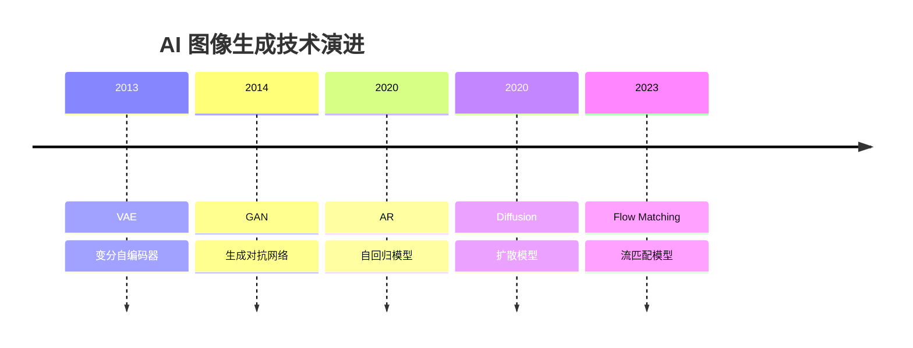
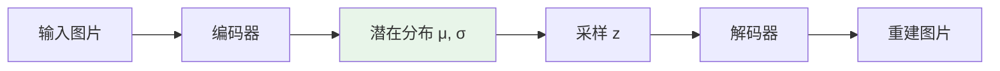
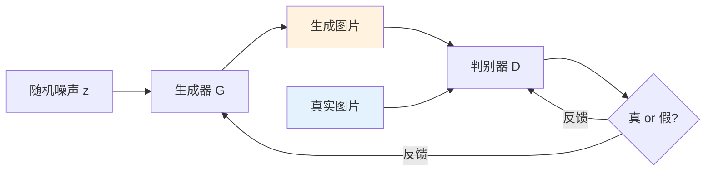
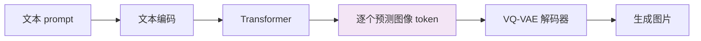
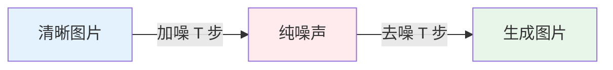
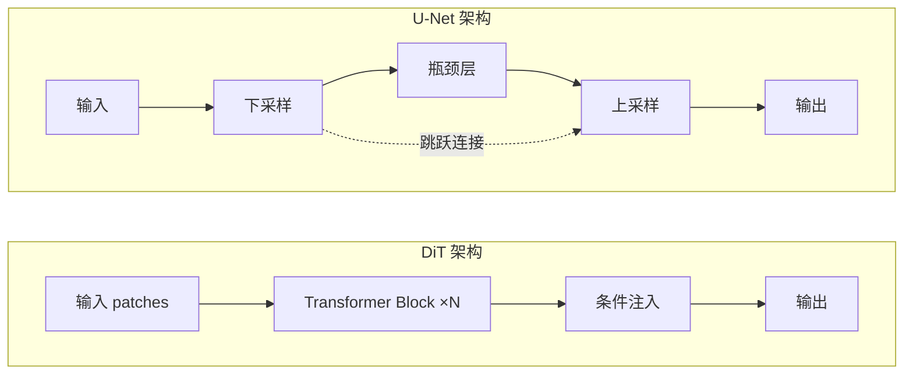
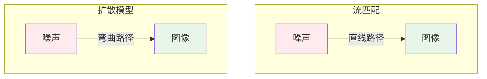

# AI 图像生成技术演进：五大范式全解析

> 从 VAE 到流匹配，AI 图像生成经历了怎样的技术革命？本文用通俗的语言带你理解五大核心范式。

## 引言

想象你是一个画家。传统编程就像"按编号填色"——每个像素都要精确指定。而 AI 图像生成则完全不同：机器通过学习海量图片的"规律"，自己学会了"画画"。

从 2013 年 VAE 的诞生到 2024 年流匹配模型的崛起，AI 图像生成技术经历了五次重大范式变革。每一次变革都让生成的图像质量更高、控制更精细、速度更快。

## 一、VAE：学会"压缩"与"还原"的画家

### 核心思想

**VAE（Variational Autoencoder，变分自编码器）** 的思路非常直觉：先把一张图片"压缩"成一小段数字摘要（潜在向量），再从这段摘要"还原"出图片。

打个比方：你看了一幅风景画，然后用几个关键词描述它——"蓝天、绿山、小河"。接着让另一个人根据这几个关键词重新画出来。VAE 就是在学习这个"描述"和"重绘"的过程。

### 工作原理

VAE 由两部分组成：

- **编码器（Encoder）**：把图片压缩成一个"潜在空间"中的概率分布（不是一个固定的点，而是一个模糊区域）
- **解码器（Decoder）**：从潜在空间中采样一个点，还原成图片

关键创新在于：编码器输出的不是一个确定的值，而是一个均值和方差——这让模型在生成时有了"创造力"，同一段描述可以生成略有不同的图片。

### 代表技术

| 模型     | 年份 | 贡献                               |
| -------- | ---- | ---------------------------------- |
| VAE      | 2013 | 首次提出变分推断 + 生成模型框架    |
| VQ-VAE   | 2017 | 引入离散潜在空间，大幅提升图像质量 |
| VQ-VAE-2 | 2019 | 多尺度层级结构，接近真实图像质量   |

### 优缺点

- **优点**：训练稳定、有明确的数学框架、潜在空间平滑可插值
- **缺点**：生成的图像偏模糊（因为优化目标倾向于"平均化"）、细节不够丰富
- **适用场景**：图像压缩、特征学习、作为其他模型的组件（如 Stable Diffusion 的图像编码器就是 VAE）

## 二、GAN：两个 AI 的"猫鼠游戏"

### 核心思想

**GAN（Generative Adversarial Network，生成对抗网络）** 是 2014 年 Ian Goodfellow 提出的天才设计：让两个神经网络互相"对抗"。

想象一个场景：一个人专门造假钞（生成器），另一个人专门鉴定假钞（判别器）。造假的人不断改进技术，鉴定的人也不断提升眼力。经过无数轮博弈，造假的人最终能造出连专家都分辨不了的"假钞"。

### 工作原理

- **生成器（Generator）**：从随机噪声出发，尝试生成逼真的图片
- **判别器（Discriminator）**：判断一张图片是"真实的"还是"生成器伪造的"

两者交替训练：生成器努力骗过判别器，判别器努力识破生成器。这个过程在数学上是一个极小极大博弈（minimax game）。

### 代表技术

| 模型        | 年份      | 突破点                                  |
| ----------- | --------- | --------------------------------------- |
| GAN         | 2014      | 开创对抗训练范式                        |
| DCGAN       | 2015      | 引入卷积架构，稳定训练                  |
| ProGAN      | 2017      | 渐进式增长，首次生成 1024×1024 高清人脸 |
| StyleGAN    | 2018      | 风格控制机制，生成质量飞跃              |
| StyleGAN2/3 | 2020-2021 | 消除伪影，业界质量标杆                  |
| GigaGAN     | 2023      | 扩展到十亿参数，支持文生图              |

### 优缺点

- **优点**：生成图像锐利、细节丰富、推理速度快（一次前向传播即可）
- **缺点**：训练不稳定（模式崩塌、训练震荡）、多样性不足、难以控制生成内容
- **适用场景**：人脸生成、图像超分辨率、风格迁移、数据增强

### 经典案例

StyleGAN 系列是 GAN 的巅峰之作。你在网上看到的 [thispersondoesnotexist.com](https://thispersondoesnotexist.com) 那些以假乱真的人脸照片，背后就是 StyleGAN。它能精确控制人脸的年龄、表情、发型等属性，生成的图像在当时让人难以分辨真假。

## 三、自回归模型（AR）：像写文章一样"画"图片

### 核心思想

**自回归模型（Autoregressive Model）** 的思路来自自然语言处理：既然 GPT 可以一个词一个词地"写"出文章，那能不能一个像素一个像素（或一个图块一个图块）地"写"出图片？

就像你写一篇文章，每个字都基于前面已写的内容来决定——自回归模型生成图片也是这样：先生成左上角，再根据已有部分决定下一个区域，逐步"写"完整张图。

### 工作原理

1. 先用 VQ-VAE 把图片编码成一系列离散的"图像 token"（类似文字 token）
2. 用 Transformer 按照从左到右、从上到下的顺序，逐个预测下一个 token
3. 最后用 VQ-VAE 的解码器把 token 序列还原成图片

### 代表技术

| 模型     | 年份 | 突破点                                   |
| -------- | ---- | ---------------------------------------- |
| PixelCNN | 2016 | 像素级自回归，奠定基础                   |
| DALL-E   | 2021 | 首个大规模文生图自回归模型（120 亿参数） |
| Parti    | 2022 | Google 的 200 亿参数文生图模型           |
| LlamaGen | 2024 | 用 LLaMA 架构做图像生成                  |
| Emu3     | 2024 | 统一文本-图像-视频的自回归生成           |

### 优缺点

- **优点**：天然统一文本和图像生成（同一个框架）、能利用大语言模型的成熟基础设施、支持多模态生成
- **缺点**：生成速度慢（必须逐个 token 生成）、图像质量不如扩散模型、存在误差累积问题
- **适用场景**：多模态生成（文本+图像混合生成）、需要与语言模型统一的场景

### 最新趋势

2024 年以来，自回归模型迎来"文艺复兴"。随着 LLM 基础设施的成熟，越来越多的研究探索用自回归范式统一所有模态。Meta 的 Emu3 和字节的 Seedream 都展示了自回归方法在图像质量上追赶扩散模型的潜力。

## 四、扩散模型：从噪声中"雕刻"出图像

### 核心思想

**扩散模型（Diffusion Model）** 是目前 AI 图像生成的主流范式。它的灵感来自物理学中的扩散现象。

想象你把一滴墨水滴进清水中——墨水会逐渐扩散，最终整杯水变成均匀的淡色。扩散模型学习的就是这个过程的**逆过程**：从一杯"均匀的淡色水"（随机噪声）出发，一步步去除噪声，最终还原出那滴"墨水"（清晰图片）。

### 工作原理

分为两个阶段：

1. **前向扩散（加噪）**：对一张真实图片逐步添加高斯噪声，经过 T 步后变成纯噪声
2. **反向去噪（生成）**：从纯噪声出发，神经网络预测每一步应该去除的噪声，逐步还原清晰图像

### 两大架构：U-Net vs DiT

扩散模型的核心是去噪网络的架构，主要有两种：

#### U-Net 架构（2020-2023 主流）

U-Net 是一种"先缩小再放大"的对称结构，像字母 U。它通过跳跃连接保留细节信息，非常适合图像到图像的任务。

- Stable Diffusion 1.x/2.x、DALL-E 2、Imagen 都使用 U-Net
- 优点：参数效率高，推理相对较快
- 局限：难以大幅扩展模型规模

#### DiT 架构（2023 至今主流）

**DiT（Diffusion Transformer）** 把扩散模型的骨干从 U-Net 换成了 Transformer。Transformer 的优势在于可以轻松地堆叠更多层、使用更大的模型——"大力出奇迹"在这里同样适用。

- Stable Diffusion 3、FLUX、DALL-E 3、Midjourney v6 都转向了 DiT 架构
- 优点：扩展性强（模型越大效果越好）、与文本的交互更自然
- 挑战：计算量大，推理成本高

### 代表技术

| 模型               | 年份      | 架构        | 突破点                                        |
| ------------------ | --------- | ----------- | --------------------------------------------- |
| DDPM               | 2020      | U-Net       | 证明扩散模型能生成高质量图像                  |
| DALL-E 2           | 2022      | U-Net       | CLIP 引导的文生图                             |
| Stable Diffusion   | 2022      | U-Net       | 潜在空间扩散，开源标杆                        |
| Imagen             | 2022      | U-Net       | 超强文本理解能力                              |
| SDXL               | 2023      | U-Net       | 1024×1024 高质量开源模型                      |
| DiT                | 2023      | Transformer | 用 Transformer 替代 U-Net                     |
| Stable Diffusion 3 | 2024      | MMDiT       | 多模态 DiT 架构，文本遵循性大增               |
| FLUX               | 2024      | DiT         | 黑森林实验室（SD 原班人马），极强的质量和速度 |
| Seedream           | 2024-2025 | DiT         | 火山引擎文生图模型，工业级质量                |

### 优缺点

- **优点**：生成质量最高、训练稳定、多样性好、支持精细的条件控制
- **缺点**：推理速度慢（需要多步去噪）、计算成本高
- **适用场景**：文生图、图像编辑、图像超分辨率、图像修复——几乎所有图像生成任务

### Stable Diffusion 的巧妙设计

Stable Diffusion 之所以能在消费级 GPU 上运行，关键在于**潜在空间扩散（Latent Diffusion）**：不是直接在像素空间做扩散（512×512×3 = 786,432 维），而是先用 VAE 编码器将图片压缩到 64×64×4 的潜在空间（16,384 维），在这个小得多的空间上做扩散，最后再用 VAE 解码器还原回像素。这把计算量降低了几十倍。

## 五、流匹配：扩散模型的"高速公路"

### 核心思想

**流匹配（Flow Matching）** 可以看作扩散模型的"进化版"。如果说扩散模型是在噪声和图像之间走一条"弯曲的小路"，那流匹配就是修了一条"直达高速公路"。

更技术地说：扩散模型通过随机微分方程（SDE）描述加噪/去噪过程，路径是弯曲的；流匹配通过常微分方程（ODE）定义一条从噪声到图像的直线路径，让模型学习沿着这条直线"推"过去。

### 工作原理

1. 定义一条从噪声分布到数据分布的**直线路径**（而不是扩散模型的弯曲路径）
2. 在路径上的任意时间点 t，插值得到中间状态：`x_t = (1-t) × 噪声 + t × 真实图片`
3. 训练网络预测在每个时间点上应该"推动"样本的速度（velocity）

### 为什么更快？

路径更直 → 用更少的步数就能走完全程。扩散模型可能需要 20-50 步才能生成高质量图像，流匹配通常 4-10 步就够了。这在实际部署中意味着几倍的速度提升。

### 代表技术

| 模型               | 年份 | 突破点                               |
| ------------------ | ---- | ------------------------------------ |
| Flow Matching      | 2022 | 提出连续正则化流的简化训练方法       |
| Rectified Flow     | 2022 | 直线化传输路径，加速采样             |
| Stable Diffusion 3 | 2024 | 首个大规模采用流匹配的文生图模型     |
| FLUX               | 2024 | 基于 Rectified Flow 的高质量开源模型 |
| Lumina-T2X         | 2024 | 统一文-图-视频-音频的流匹配框架      |

### 优缺点

- **优点**：采样步数更少、推理更快、训练目标更简单直接、数学框架更优雅
- **缺点**：技术相对较新、生态尚在建设中
- **适用场景**：高速推理、实时生成、需要效率的生产环境

## 五大范式横向对比

| 维度           | VAE        | GAN        | 自回归 AR  | 扩散模型   | 流匹配     |
| -------------- | ---------- | ---------- | ---------- | ---------- | ---------- |
| **生成质量**   | ⭐⭐       | ⭐⭐⭐⭐   | ⭐⭐⭐     | ⭐⭐⭐⭐⭐ | ⭐⭐⭐⭐⭐ |
| **生成速度**   | ⭐⭐⭐⭐⭐ | ⭐⭐⭐⭐⭐ | ⭐⭐       | ⭐⭐       | ⭐⭐⭐⭐   |
| **训练稳定性** | ⭐⭐⭐⭐   | ⭐⭐       | ⭐⭐⭐⭐   | ⭐⭐⭐⭐⭐ | ⭐⭐⭐⭐⭐ |
| **多样性**     | ⭐⭐⭐     | ⭐⭐       | ⭐⭐⭐⭐   | ⭐⭐⭐⭐⭐ | ⭐⭐⭐⭐⭐ |
| **可控性**     | ⭐⭐       | ⭐⭐⭐     | ⭐⭐⭐⭐   | ⭐⭐⭐⭐⭐ | ⭐⭐⭐⭐   |
| **多模态统一** | ⭐⭐       | ⭐         | ⭐⭐⭐⭐⭐ | ⭐⭐⭐     | ⭐⭐⭐⭐   |
| **主流时期**   | 2013-2017  | 2014-2021  | 2021-至今  | 2022-至今  | 2024-至今  |

## 技术演进的规律

回顾这五大范式的演进，可以总结出几条规律：

### 1. 从"对抗"到"合作"

GAN 依赖两个网络的对抗博弈，训练不稳定；扩散模型和流匹配都是单网络训练，目标明确，训练稳定得多。

### 2. 从"一步到位"到"逐步精化"

VAE 和 GAN 都是一次前向传播直接出图；扩散模型通过多步迭代逐渐精化，虽然慢，但质量更高。流匹配则在保持高质量的同时，尽量减少步数。

### 3. Transformer 统一一切

从 U-Net 到 DiT，Transformer 架构正在统一所有生成范式。无论是扩散模型、流匹配还是自回归模型，底层都在向 Transformer 靠拢。

### 4. 多模态融合是终局

最新的趋势是用同一个框架处理文本、图像、视频、音频——自回归模型在这方面天然有优势，但扩散/流匹配模型也在积极跟进。

## 总结

AI 图像生成技术的演进并非简单的"替代"关系，而是**互补与融合**：

- **VAE** 虽然不直接用于最终生成，但作为图像编解码器活跃在 Stable Diffusion 等系统中
- **GAN** 在实时生成、超分辨率等追求速度的场景仍有用武之地
- **自回归模型** 在多模态统一方面独具优势，正在与大语言模型深度融合
- **扩散模型** 是当前的质量之王，生态最完善
- **流匹配** 代表了下一代技术方向，在速度和质量间取得更好平衡

未来，这些范式将进一步融合。我们已经看到 Stable Diffusion 3 同时使用了 VAE（编解码）、DiT（去噪骨干）和流匹配（训练范式）——一个模型集三种范式于一身。AI 图像生成的下一章，将是这些技术"大融合"的故事。
