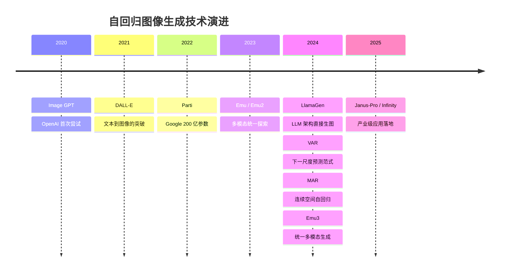
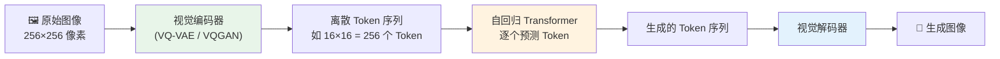
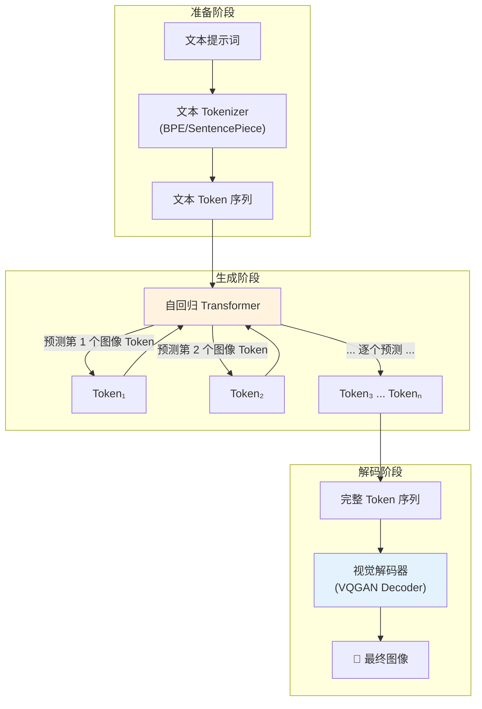
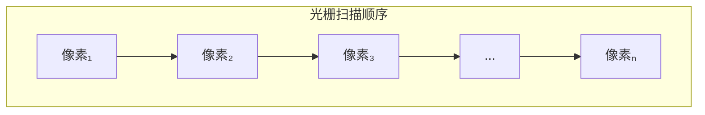
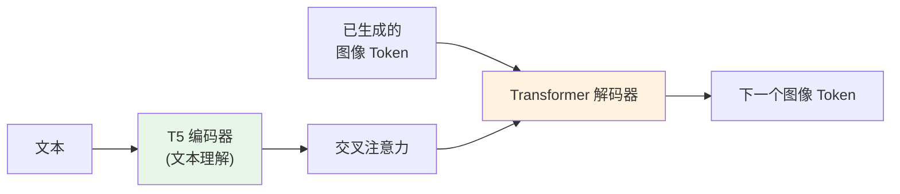
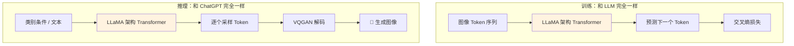
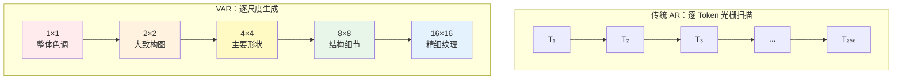
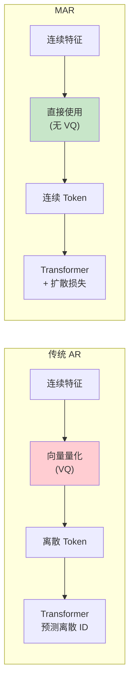
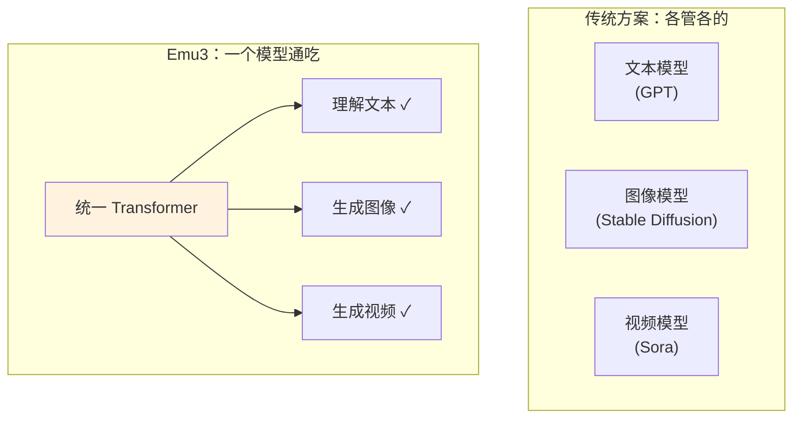
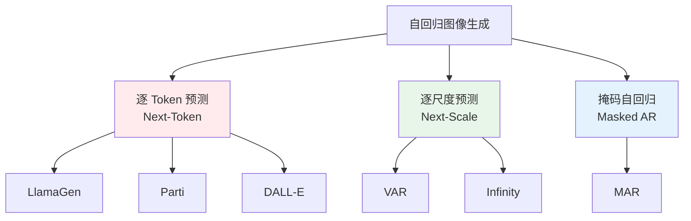

# 自回归图像生成深度解析：从 Token 预测到视觉创造

> 像写小说一样画画——自回归模型如何一个 Token 一个 Token 地"写出"一幅图像？从 DALL-E 到 LlamaGen、VAR、Emu3，深入解读 AR 图像生成的技术原理与前沿进展。

## 引言

你有没有想过，ChatGPT 是怎么"写"文章的？它并不是一口气写完整篇文章，而是**一个字一个字地往下写**——每次看看前面已经写了什么，然后预测下一个最合适的字。这就是**自回归（Autoregressive, AR）** 的核心思想。

现在，想象一下：如果我们把一幅图像也拆成一个个"视觉单词"，是不是也能像写文章一样，一个词一个词地"写出"一幅画？

答案是：**完全可以！**

事实上，这个思路催生了一个蓬勃发展的研究方向——**自回归图像生成**。从 2020 年 OpenAI 的 Image GPT，到 2022 年 Google 的 Parti，再到 2024 年引爆学术圈的 LlamaGen、VAR、Emu3，自回归方法正在向扩散模型发起强有力的挑战。



本文将带你深入理解自回归图像生成的核心原理、主流技术路线及代表模型，让你不仅"知其然"，更"知其所以然"。

## 一、核心原理：像写作文一样画画

### 1.1 什么是自回归？

自回归的本质只有一句话：**根据已有的内容，预测下一个内容。**

想象你在玩一个接龙游戏：

> "春天来了，\_\_\_"

你的大脑会自动根据前面的上下文，预测最合理的下一个词——比如"花开了"。这就是自回归。

用数学语言说，自回归模型将联合概率分解为条件概率的连乘：

```
P(x₁, x₂, ..., xₙ) = P(x₁) × P(x₂|x₁) × P(x₃|x₁,x₂) × ... × P(xₙ|x₁,...,xₙ₋₁)
```

每一步都只需要回答一个问题："给定前面的所有 Token，下一个 Token 最可能是什么？"

### 1.2 从文本到图像：视觉 Tokenization

文本天然就是一个 Token 序列——每个字、每个词都是一个 Token。但图像是一个二维的像素矩阵，怎么变成 Token 序列呢？

这就需要一个关键的"翻译官"——**视觉 Tokenizer**。



视觉 Tokenizer 的工作方式就像一本**图像词典**：

1. **编码**：把图像切成小块（patch），每个小块在"词典"（codebook）里找到最接近的"单词"编号
2. **解码**：根据"单词"编号查词典，还原出对应的图像小块

这个词典通常由 **VQ-VAE** 或 **VQGAN** 训练得到（详见我们的 [VAE 深度解析](/canvasflow/topics/image/vae-deep-dive)）。词典的质量直接决定了生成图像的上限——就像一个人的词汇量决定了他能写出多好的文章。

### 1.3 自回归生图的完整流程

以文生图（Text-to-Image）为例，完整流程如下：



**Step 1**: 文本提示词被编码为文本 Token 序列（作为"条件"）

**Step 2**: Transformer 以文本 Token 为前缀，自回归地逐个生成图像 Token

**Step 3**: 所有图像 Token 通过视觉解码器还原为像素图像

这个流程与 GPT 生成文本几乎完全一致——唯一的区别是输出从文字变成了图片。

## 二、经典先驱：从像素到 Token 的进化之路

### 2.1 Image GPT（2020）：最直觉的尝试

OpenAI 的 Image GPT（iGPT）是最早的尝试之一，思路极其朴素：**直接把像素当 Token，用 GPT 来预测下一个像素。**

想象你在画一幅画，从左上角开始，一个像素一个像素地往右画，画完一行换下一行——就像打字机一样。每画一个像素，都要参考前面所有已画的像素。



**优点**：概念极其简单，证明了"像素级自回归"是可行的。

**致命缺陷**：一张 256×256 的图像有 65,536 个像素，每个像素 3 个通道——近 20 万步预测！这就像让你一笔一划写完一本几十万字的小说，速度慢到令人绝望。

> Image GPT 就像用毛笔一个点一个点地画画——理论上什么都能画，但实在太慢了。

### 2.2 DALL-E（2021）：离散 Token 的突破

OpenAI 从 Image GPT 的教训中学到了关键一课：**不要在像素级别做自回归，要先压缩！**

DALL-E 引入了两阶段策略：

| 阶段     | 任务       | 方法                                                             |
| -------- | ---------- | ---------------------------------------------------------------- |
| 第一阶段 | 图像压缩   | 用 dVAE 将 256×256 图像编码为 32×32 = 1024 个离散 Token          |
| 第二阶段 | 自回归生成 | 用 120 亿参数 Transformer 生成文本 Token + 图像 Token 的联合序列 |

从 20 万步缩减到 1024 步——提速近 200 倍！就像从"一笔一划写字"升级为"用词语造句"。

**DALL-E 的意义**：首次证明了自回归方法能实现高质量的文本到图像生成，为后续研究铺平了道路。

### 2.3 Parti（2022）：暴力美学的极致

Google 的 Parti 把自回归图像生成推向了一个新高度：**用 200 亿参数的 Transformer，暴力缩放到极致。**

Parti 使用了编码器-解码器（Encoder-Decoder）架构：

- **编码器**：处理文本输入，捕获语义信息
- **解码器**：自回归地生成图像 Token（使用 ViT-VQGAN 作为 Tokenizer）
- **参数规模**：从 350M 一路扩展到 20B



Parti 揭示了一个重要规律：**自回归图像模型同样服从缩放定律（Scaling Law）**——模型越大、数据越多、生成质量越好。这与 LLM 领域的发现完全一致。

## 三、新范式爆发：2024 年的 AR 文艺复兴

2024 年，自回归图像生成迎来了一场"文艺复兴"。多个突破性工作几乎同时涌现，从不同维度重新定义了这个领域。

### 3.1 LlamaGen：用 LLM 架构直接生图

**核心思想**：既然 LLaMA 是最强大的语言模型之一，能不能直接拿 LLaMA 的架构来生成图像？

答案是：**完全可以，而且效果出人意料地好！**

LlamaGen 的做法堪称"大道至简"：

1. 用 VQGAN 将图像编码为离散 Token
2. 把这些 Token 扔进一个标准的 LLaMA 架构（decoder-only Transformer）
3. 用标准的下一个 Token 预测（next-token prediction）进行训练
4. 生成时逐个采样 Token，最后用 VQGAN 解码还原图像



**关键发现**：

| 发现                      | 意义                                                |
| ------------------------- | --------------------------------------------------- |
| 无需任何视觉特殊设计      | 纯 LLM 架构就能生图，打破了"视觉需要特殊架构"的偏见 |
| 缩放定律同样成立          | 从 111M 到 3.1B，FID 持续下降，质量持续提升         |
| CFG（分类器自由引导）有效 | 扩散模型的增强技巧可以直接移植到 AR 模型            |
| KV-Cache 可直接复用       | LLM 领域的推理加速技术无缝迁移                      |

> LlamaGen 告诉我们：图像生成和文本生成，在数学本质上没有什么不同。不同之处仅在于 Token 的含义——一个是文字，一个是图像小块。

**论文**：_Autoregressive Model Beats Diffusion: Llama for Scalable Image Generation_（Sun et al., 2024）

### 3.2 VAR：颠覆性的"下一尺度预测"

如果说 LlamaGen 证明了"老路也能走通"，那么 VAR 则开辟了一条全新的路。

**传统 AR 的问题**：图像 Token 按光栅扫描顺序（从左到右、从上到下）逐个生成。这就像画画时从左上角一个像素一个像素地画——既不符合人类的绘画习惯，也很难捕获全局结构。

**VAR 的灵感**：人类画家是怎么画画的？先画大致轮廓，再逐步填充细节——**从粗到细（coarse-to-fine）**。



**VAR 的工作方式**：

1. 将图像表示为多尺度的 Token 图（1×1 → 2×2 → 4×4 → ... → 16×16）
2. 每一步预测**整个下一个尺度**的所有 Token（而非单个 Token）
3. 每个尺度的预测以所有更粗尺度的 Token 为条件

这就像画家先用几笔勾勒出整幅画的色调和构图，然后逐步细化轮廓、添加细节、描绘纹理。

**关键优势**：

| 维度       | 传统 AR（逐 Token）        | VAR（逐尺度）          |
| ---------- | -------------------------- | ---------------------- |
| 生成步数   | 256 步（16×16）            | 10 步（10 个尺度）     |
| 全局一致性 | 较弱（逐像素缺乏全局视野） | 较强（先画全局再细化） |
| 生成速度   | 较慢                       | 快 20 倍以上           |
| 缩放定律   | 存在                       | 更显著                 |
| 符合直觉   | 不符合（光栅扫描）         | 符合（由粗到细）       |

VAR 在 ImageNet 256×256 上取得了极具竞争力的 FID 分数，同时生成速度比传统 AR 模型快一个数量级。

> VAR 就像从"一笔一划写楷书"升级为"先写草稿再润色"——既快又好。

**论文**：_Visual Autoregressive Modeling: Scalable Image Generation via Next-Scale Prediction_（Tian et al., 2024）

### 3.3 MAR：不要离散化，直接在连续空间里自回归

前面所有模型都依赖一个共同前提：**必须先把图像变成离散 Token**。但 VQ（向量量化）过程不可避免地会损失信息——就像把一首交响乐压缩成 MIDI 文件，总会丢失一些微妙的细节。

MAR（Masked Autoregressive Model）提出了一个大胆的问题：**能不能跳过离散化，直接在连续空间里做自回归？**



**MAR 的核心创新**：

1. **去掉 VQ**：直接使用 VAE 编码器输出的连续特征，不做量化
2. **掩码自回归**：训练时随机遮挡部分 Token，让模型预测被遮挡的 Token（类似 BERT 的做法，但用于生成）
3. **扩散损失**：对每个被遮挡的 Token，使用一个小型扩散模型来建模其连续分布

**生成过程**：不是一个一个 Token 地生成，而是多轮迭代——每轮预测一部分 Token，逐步填满整幅图像。就像做拼图，每次放入几块，而不是一块一块放。

| 指标                 | 数值                   |
| -------------------- | ---------------------- |
| ImageNet 256×256 FID | ~1.55（2024 年最优）   |
| 生成速度             | 比逐 Token AR 快数十倍 |
| 信息保真度           | 优于离散 Token 方法    |

> MAR 告诉我们：自回归不一定要"一个接一个"，也不一定要"离散化"。打破这两个限制，性能反而更好。

**论文**：_Autoregressive Image Generation without Vector Quantization_（Li et al., 2024, NeurIPS 2024）

### 3.4 Emu3：一个模型统一所有模态

如果说前面的模型还聚焦在图像生成这单一任务上，那么 **Emu3** 的野心要大得多：**用一个自回归模型统一文本理解、图像生成和视频生成。**



**Emu3 的设计哲学**：

1. **统一 Tokenization**：文本用 BPE Tokenizer，图像和视频用高质量视觉 Tokenizer，所有模态都变成同一种"语言"——离散 Token 序列
2. **统一训练目标**：只有一个目标——**下一个 Token 预测**。不需要扩散损失、不需要对比学习、不需要任何模态特定的技巧
3. **统一推理**：生成图像就是生成一段"图像语言"的文本，生成视频就是生成一段"视频语言"的文本

**Emu3 的意义**：它用实验证明了一个激动人心的假设——**Next-Token Prediction Is All You Need**。一个足够强大的自回归模型，仅凭下一个 Token 预测，就能同时胜任理解和生成多种模态的内容。

> Emu3 就像一个精通多国语言的翻译官——不管你给他中文、英文还是"图片语"，他都能理解和回应。而他学习的方法只有一个：不断练习"接下来该说什么"。

**论文**：_Emu3: Next-Token Prediction is All You Need_（BAAI, 2024）

## 四、2025 前沿：产业化与新方向

### 4.1 Janus-Pro：理解与生成的双通道架构

DeepSeek 的 Janus-Pro 提出了一个务实的洞察：**视觉理解和视觉生成需要不同的表示方式。**

理解图像时，我们需要捕获高层语义（"这是一只猫"）；生成图像时，我们需要精确的低层细节（"毛发的纹理"）。把两种需求塞进同一个 Tokenizer 是一种过度简化。

Janus-Pro 的解法：在统一的 Transformer 内部，为理解和生成使用**不同的视觉编码路径**，但共享语言模型主干。

### 4.2 Infinity：比特级的极致压缩

ByteDance 的 Infinity 将 Token 预测推向了更细的粒度——**比特级预测**。通过逐比特地预测视觉 Token，Infinity 实现了更高效的信息编码和更好的生成质量，并结合了下一尺度预测的范式，能够高效生成高分辨率图像。

### 4.3 统一多模态大趋势

2025 年的一个显著趋势是：**自回归图像生成不再是一个独立的方向，而是融入了统一多模态大模型的浪潮中。**

| 模型        | 机构      | 特点                      |
| ----------- | --------- | ------------------------- |
| Chameleon   | Meta      | 混合 Token 的多模态自回归 |
| Janus-Pro   | DeepSeek  | 双通道视觉编码            |
| Emu3        | BAAI      | 纯 next-token 统一生成    |
| Transfusion | Meta      | 混合自回归 + 扩散         |
| Infinity    | ByteDance | 比特级下一尺度预测        |

这些工作共同指向一个未来：**一个模型，理解一切，生成一切。**

## 五、三大技术路线对比

经过前面的梳理，我们可以把 2024-2025 年的 AR 图像生成归纳为三大技术路线：

| 维度                | 逐 Token 预测            | 逐尺度预测                 | 掩码自回归           |
| ------------------- | ------------------------ | -------------------------- | -------------------- |
| 代表模型            | LlamaGen, Parti, DALL-E  | VAR, Infinity              | MAR                  |
| Token 空间          | 离散                     | 离散                       | 连续                 |
| 生成顺序            | 光栅扫描（左→右，上→下） | 粗→细（低分辨率→高分辨率） | 随机掩码→迭代填充    |
| 单步输出            | 1 个 Token               | 1 个尺度的所有 Token       | 一批被遮挡的 Token   |
| 生成步数            | 多（数百步）             | 少（约 10 步）             | 中等（约 20-50 步）  |
| 全局一致性          | 中等                     | 强                         | 强                   |
| 与 LLM 的兼容性     | 最高（架构完全一致）     | 中等（需要多尺度设计）     | 中等（需要掩码调度） |
| 最佳 FID (ImageNet) | ~2.18                    | ~1.73                      | ~1.55                |



## 六、AR vs 扩散模型：一场正在进行的竞赛

自回归模型和扩散模型是当今图像生成的两大范式。它们各有所长：

| 维度            | 自回归模型                | 扩散模型                       |
| --------------- | ------------------------- | ------------------------------ |
| 生成方式        | 逐 Token 顺序生成         | 逐步去噪                       |
| 理论基础        | 自回归概率分解            | 随机微分方程 / 去噪            |
| 与 LLM 的统一性 | 天然统一（same paradigm） | 需要额外桥接                   |
| 多模态扩展      | 容易（统一 Token 空间）   | 较难（需要不同的条件注入方式） |
| 生成多样性      | 通过采样温度控制          | 通过引导强度控制               |
| 编辑能力        | 较弱（序列化限制）        | 较强（Inpainting 等）          |
| 推理加速        | KV-Cache、投机解码        | DDIM、蒸馏、一致性模型         |
| 工业生态        | 快速成长中                | 成熟（Stable Diffusion 生态）  |

**自回归模型的核心优势**是与 LLM 的统一性。当我们追求"一个模型理解和生成一切"时，自回归框架是最自然的选择——因为 GPT、LLaMA 本身就是自回归模型。

**扩散模型的核心优势**是成熟的生态和灵活的编辑能力。ControlNet、IP-Adapter、Inpainting 等技术已经形成了完善的工具链。

> 二者并非你死我活的关系。事实上，MAR 和 Transfusion 等工作已经在探索**二者的融合**——用自回归做全局结构，用扩散做局部细节。

## 七、应用场景

### 7.1 统一多模态 AI 助手

自回归的最大魅力在于**统一性**。一个自回归模型既能聊天、又能画图、还能生成视频——这正是下一代 AI 助手的理想形态。用户只需要用自然语言描述需求，AI 就能无缝切换文本回复和图像创作。

### 7.2 交互式图像创作

自回归模型的序列化特性使其天然适合**多轮对话式创作**：

- "画一只橘猫在窗台上晒太阳"
- "把背景换成星空"
- "给猫加一顶圣诞帽"

每次编辑都可以在之前的 Token 序列基础上进行条件生成。

### 7.3 长序列视觉叙事

自回归模型擅长处理**有序列依赖的任务**——比如生成连环画、分镜头脚本、视频帧序列。每一帧都能自然地依赖前面的帧，保持叙事的连贯性。

### 7.4 代码/设计稿到 UI

结合多模态能力，自回归模型可以理解设计稿或代码描述，直接生成对应的 UI 界面图像——实现从描述到视觉的端到端转换。

## 八、总结与展望

自回归图像生成正在经历一场华丽的复兴。从 2020 年 Image GPT 的青涩尝试，到 2024-2025 年 LlamaGen、VAR、MAR、Emu3 的全面爆发，AR 模型已经从"备选方案"成长为能与扩散模型分庭抗礼的主流范式。

**三个关键洞察**：

1. **架构统一**：LlamaGen 证明了 LLM 架构可以直接用于图像生成，打通了语言和视觉的技术壁垒
2. **范式创新**：VAR 的下一尺度预测和 MAR 的连续空间自回归，分别从生成顺序和表示空间两个维度突破了传统 AR 的局限
3. **模态统一**：Emu3 展示了"Next-Token Prediction Is All You Need"的愿景——一个模型，一种训练方式，统一所有模态

展望未来，自回归图像生成的发展方向可能包括：

- **更高效的视觉 Tokenizer**：压缩率更高、重建质量更好的 Tokenizer 将解锁更高分辨率的生成
- **AR + 扩散的混合架构**：结合两种范式的优势，用 AR 做全局规划，用扩散做局部精修
- **真正的通用多模态模型**：一个模型无缝处理文本、图像、视频、音频、3D 等所有模态
- **实时交互式生成**：结合推理加速技术（投机解码、并行预测），实现毫秒级的交互式创作

**图像生成的未来，也许不是扩散或自回归的二选一，而是二者在统一框架下的融合共生。**

## 参考文献

1. Chen, M., Radford, A., et al. _Generative Pretraining from Pixels._ ICML 2020. (Image GPT)
2. Ramesh, A., Pavlov, M., et al. _Zero-Shot Text-to-Image Generation._ ICML 2021. (DALL-E)
3. Yu, J., Li, X., et al. _Scaling Autoregressive Models for Content-Rich Text-to-Image Generation._ TMLR 2022. (Parti)
4. Sun, P., Jiang, Y., et al. _Autoregressive Model Beats Diffusion: Llama for Scalable Image Generation._ arXiv:2406.06525, 2024. (LlamaGen)
5. Tian, K., Jiang, Y., et al. _Visual Autoregressive Modeling: Scalable Image Generation via Next-Scale Prediction._ NeurIPS 2024. (VAR)
6. Li, T., Tian, Y., et al. _Autoregressive Image Generation without Vector Quantization._ NeurIPS 2024. (MAR)
7. Wang, et al. _Emu3: Next-Token Prediction is All You Need._ arXiv, 2024. (Emu3)
