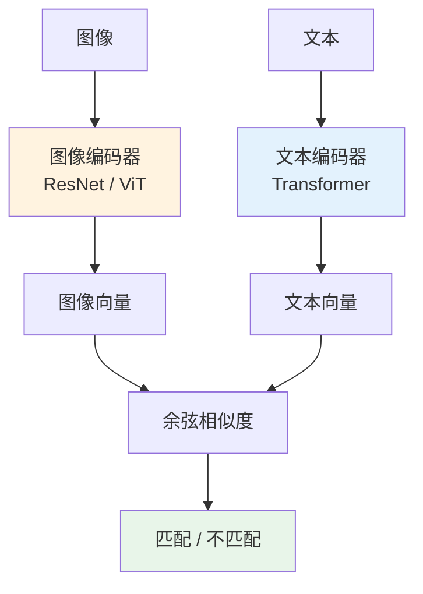
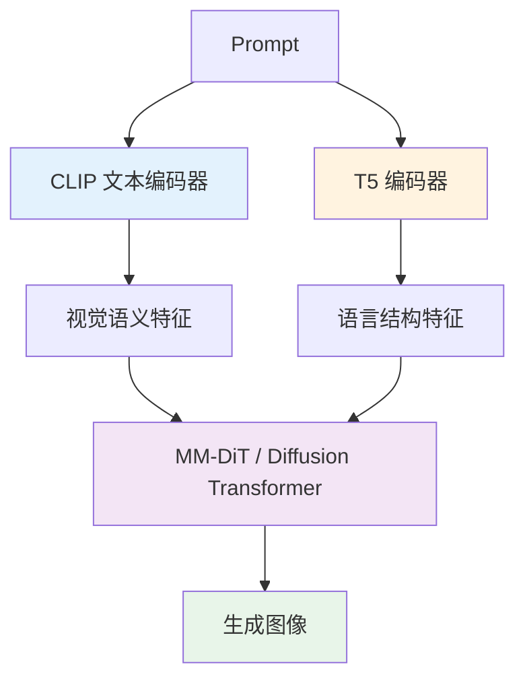

# CLIP / T5 深度解析：文生图时代的两位“提示词翻译官”

> 同样一句提示词，为什么有的模型只能画出“差不多”，有的模型却能准确理解“左边一只戴红围巾的柴犬，右边一台贴着便签的复古电视机，背景是下雪的东京街头”？答案往往不只在扩散模型本身，还在它前面那两位默默工作的“翻译官”——CLIP 和 T5。

## 引言

很多人一提到文生图，注意力都会集中在扩散模型、DiT、采样步数、CFG、LoRA 上。

但真正决定模型**“有没有听懂你的话”**的，往往是更前面的一环：**文本编码器（Text Encoder）**。

你可以把一条文生图链路想象成一家电影制作公司：

- **提示词** 是甲方发来的需求文档
- **CLIP / T5** 是两位不同风格的编剧
- **扩散模型 / Transformer** 是导演和摄影团队
- **最终图片** 是拍出来的成片

如果编剧一开始就把需求理解歪了，导演再强，最后也只能拍出“很精美，但不是你要的”。

在过去几年里，CLIP 和 T5 成了图像生成系统里最重要的两类“语言理解底座”之一：

- **CLIP** 更像一个长期浸泡在图文世界里的“视觉语义翻译官”，擅长把词和图像对上号
- **T5** 更像一个逻辑清晰、语法扎实的“语言结构分析师”，擅长理解长句、关系和复杂约束

为什么 Stable Diffusion 1.x 大量使用 CLIP？为什么 Imagen、Stable Diffusion 3、FLUX 又纷纷把 T5 引进来，甚至与 CLIP 组合使用？

这篇文章就来把这件事讲透。

---

## 一、先回答一个根问题：文生图为什么需要“文本编码器”？

神经网络并不直接理解“赛博朋克少女”“电影级光影”“左边站着一只猫”这些自然语言。对模型来说，文字只是离散 token，必须先被转换成一串可计算的向量表示，后面的图像生成网络才能消费。

这个过程就像：

- 人类说的是**自然语言**
- 生成模型吃的是**高维向量**
- 文本编码器负责把前者翻译成后者

在这条链路里，文本编码器至少承担三件事：

1. **把词义变成数值表示**：让“猫”和“狗”在语义空间里可区分
2. **理解词与词之间的关系**：比如“左边”“抱着”“站在……前面”
3. **把语言信号传给图像生成器**：告诉后者应该画什么、不要画什么、重点画哪部分

这就是为什么，文生图系统里的文本编码器不是可有可无的配角，而是决定“理解力上限”的关键部件。

---

## 二、CLIP：让文字和图像“说同一种语言”

### 2.1 CLIP 到底是什么？

**CLIP（Contrastive Language-Image Pretraining）** 由 OpenAI 在 2021 年提出。它最核心的思想可以概括成一句话：

> **让图片和描述这张图片的文字，在同一个语义坐标系里彼此靠近。**

你可以把它想象成在建立一个巨大的“双语词典”：

- 一边是图片
- 一边是文字
- CLIP 要学会判断哪段文字和哪张图是“一对”

如果一张图是“一只狗在雪地里奔跑”，那它的图像向量就应该靠近“a dog running in the snow”这样的文本向量，远离“a red sports car on a highway”这样的文本向量。

### 2.2 CLIP 的架构：双塔模型

CLIP 的经典结构是一个**双编码器（dual encoder）**：

- **图像编码器**：把图片编码成一个向量
- **文本编码器**：把文字编码成一个向量

然后计算这两个向量的相似度。

这套结构很像相亲节目：

- 左边坐着图片嘉宾
- 右边坐着文字嘉宾
- 模型要学会判断“谁和谁最配”

### 2.3 CLIP 是怎么训练的？

CLIP 依赖的是**对比学习（Contrastive Learning）**。

一个 batch 里会同时放很多图文对。对每张图片来说，和它配套的那句文字是**正样本**，其他文字都是**负样本**；对每句文字也是同理。

训练目标就是：

- 拉近正确图文对的向量距离
- 拉远错误图文对的向量距离

你可以把它理解成一个“大型配对训练营”：

- 配对正确，奖励
- 配对错误，惩罚
- 训练久了，模型自然学会“什么文字通常对应什么画面”

CLIP 的真正厉害之处在于，它不是在一个很小的标注数据集上学习“猫=cat、狗=dog”，而是在海量互联网图文对上学习更开放的视觉语义——风格、物体、场景、动作、材质、构图，甚至不少文化梗。

### 2.4 为什么 CLIP 很适合早期文生图？

因为 CLIP 从出生起就在解决一个对文生图极其关键的问题：

> **如何让文字和图像处于同一个语义空间里。**

这意味着它天然擅长回答下面这些问题：

- “这句话和这张图像配不配？”
- “提示词里的主体是什么？”
- “这个风格标签在视觉上大概长什么样？”
- “这张图和目标描述谁更接近？”

所以在图像生成世界里，CLIP 经常扮演三种角色：

#### 角色 1：作为文生图的文本编码器

Stable Diffusion 1.x/2.x 一类模型里，CLIP 的**文本分支**经常直接拿来把提示词编码成文本特征，然后通过 Cross-Attention 注入 U-Net 或后续的生成骨干。

这时，真正参与推理的通常是 **CLIP text encoder**，而不是整套图像-文本双塔同时上场。

#### 角色 2：作为“图文对齐裁判”

很多生成系统会用 CLIP 来做 reranking（重排序）或打分：

- 一次生成多张候选图
- 用 CLIP 计算哪张图和提示词最匹配
- 选分最高的那张

这就像请了一个懂画也懂文案的艺术总监来做终审。

#### 角色 3：作为零样本识别与检索底座

CLIP 还可以拿来做：

- 图搜文 / 文搜图
- 零样本分类
- 自动标签生成
- 素材检索与召回

很多 AIGC 平台的素材库搜索、风格参考检索，底层也会用到类似 CLIP 的图文对齐表示。

### 2.5 CLIP 的强项和短板

#### 强项：视觉语义对齐非常强

CLIP 的强项不是“像语文老师一样精确分析复杂句法”，而是：

- 它知道“蒸汽波”“赛博朋克”“35mm 胶片感”这些词在视觉上常对应什么
- 它对物体类别、风格标签、场景描述有很强的图文映射能力
- 它擅长短提示词、标签式提示词、风格词堆叠

这也是为什么很多老牌文生图模型，在用简短 prompt 时表现反而很好。

#### 短板：长句、复杂关系、精细约束容易掉链子

CLIP 的弱点也很明显：

- 对很长的提示词不够从容
- 对复杂的语法关系、组合逻辑理解有限
- 对“谁在左边、谁抱着谁、文字要写在哪”这类细粒度约束，常常理解得不够稳定

你可以把它理解成：CLIP 很像一个“看图识意”非常强的人，但不一定是“读复杂合同条款”最稳的人。

---

## 三、T5：把所有语言任务都变成“文本到文本”

### 3.1 T5 是什么？

**T5（Text-To-Text Transfer Transformer）** 由 Google 提出。它的理念很有野心：

> **把几乎所有 NLP 任务都统一写成“输入文本 → 输出文本”的形式。**

例如：

- 翻译：`translate English to German: ...`
- 摘要：`summarize: ...`
- 问答：`question: ... context: ...`
- 分类：`sst2 sentence: ...` 输出 `positive` 或 `negative`

T5 的革命性不在于它只是一个 Transformer，而在于它把“任务形式”统一了。

这让它特别擅长处理**复杂文本理解、长上下文、结构化指令**。

### 3.2 T5 的架构：典型 Encoder-Decoder

与 CLIP 文本分支常见的单向/双向文本编码思路不同，T5 是标准的 **Encoder-Decoder Transformer**：

- **Encoder** 负责把输入文本读懂
- **Decoder** 负责把理解后的结果生成出来

在文生图系统里，很多时候并不会真的用 T5 去“生成一句文本结果”，而是主要使用它**Encoder 产生的高质量文本表示**。这些表示随后会被送进图像生成网络。

### 3.3 T5 是怎么预训练的？

T5 一个非常关键的训练策略是 **Span Corruption（片段掩码重建）**。

通俗地说，不是只挖掉一个词，而是从句子里**挖掉一整段连续文本**，再让模型补回来。

比如原句是：

> A red fox jumps over the wooden fence in the snow.

可能会被挖成：

> A red `<extra_id_0>` in the snow.

模型需要输出：

> `<extra_id_0>` fox jumps over the wooden fence

这和普通“遮一个词猜一个词”相比，更像在训练模型补全一段被撕掉的句子。结果就是：

- 它更擅长理解上下文整体结构
- 更擅长处理长距离依赖
- 更擅长解析复杂描述中的组成关系

这正是文生图复杂提示词最需要的能力之一。

### 3.4 为什么 T5 会进入图像生成？

因为图像生成的提示词越来越不像“标签堆砌”，而越来越像“带逻辑的自然语言需求文档”。

比如以前的 prompt 可能只是：

> masterpiece, best quality, 1girl, cinematic lighting

而现在很多真实业务 prompt 更像这样：

> 一个极简风的智能手表广告主视觉，表盘朝向镜头，位于画面右下角，左上角留白用于放标题，背景是浅灰到银白的渐变金属桌面，整体像 Apple 发布会 KV，画面中不要出现人物和多余文字。

这种提示词已经不只是“词袋”，而是带有：

- 空间关系
- 风格约束
- 排版要求
- 禁止项
- 语义优先级

T5 在这里的优势就体现出来了：它更像一个能真正“读懂需求说明书”的模型。

### 3.5 T5 的强项和短板

#### 强项：复杂语言理解强、长 prompt 友好

T5 的长处在于：

- 更擅长复杂句法
- 更擅长关系理解与组合泛化
- 更擅长长提示词、说明式提示词
- 对“先后、左右、包含、不包含、修饰关系”这类结构信息更敏感

#### 短板：它本身不是为“图文对齐”而生的

T5 的原生训练目标是语言理解与生成，不是图像-文本对齐。

这意味着：

- 它在语言层面很强
- 但它并不天然像 CLIP 那样“深度泡在图文配对世界里”
- 如果单独使用，可能在“视觉风格词 ↔ 实际图像效果”的直接映射上不如 CLIP 天然顺手

所以业界很快发现一个现实：

> **最好的办法常常不是二选一，而是把 CLIP 和 T5 组合起来。**

---

## 四、CLIP 和 T5 的本质区别：一个擅长“对图”，一个擅长“懂话”

很多人会问：它们不都是文本编码器吗？

是，但它们的“出身”不同，导致它们擅长的东西也不同。

| 维度             | CLIP                            | T5                            |
| ---------------- | ------------------------------- | ----------------------------- |
| 核心目标         | 图文对齐                        | 统一文本到文本迁移学习        |
| 训练数据形式     | 海量图文对                      | 海量纯文本语料                |
| 典型结构         | 图像编码器 + 文本编码器双塔     | Encoder-Decoder Transformer   |
| 最擅长           | 视觉语义映射、短 prompt、风格词 | 长 prompt、复杂语法、逻辑关系 |
| 在文生图中的优势 | “这句话像什么画面”              | “这句话到底在说什么关系”      |
| 在文生图中的弱点 | 复杂语言约束不稳定              | 原生图文对齐不如 CLIP 直接    |

如果用一个更生动的比喻：

- **CLIP** 像一个资深视觉导演，听到“胶片感、霓虹、低机位”就能立刻脑补画面
- **T5** 像一个严谨的文学编辑，能把长句中的主谓宾、限制条件、层级关系梳理清楚

文生图要想既“有画面感”，又“听得懂人话”，两者结合就非常自然了。

---

## 五、为什么新一代文生图模型越来越爱“CLIP + T5 双编码器”？

### 5.1 一个现实问题：提示词既有“视觉词”，也有“逻辑词”

看一个典型 prompt：

> 一只戴着红围巾的柴犬坐在木椅上，左边是一盏暖黄色落地灯，窗外在下雪，画面为电影海报构图，右上角留白用于标题，整体为日系胶片摄影风格。

这段 prompt 里混合了两类信息：

#### 第一类：视觉直觉很强的词

- 柴犬
- 红围巾
- 暖黄色落地灯
- 日系胶片摄影

这部分是 CLIP 的强项。

#### 第二类：结构和关系很强的词

- 坐在木椅上
- 左边是一盏灯
- 窗外在下雪
- 右上角留白用于标题

这部分更像 T5 的舞台。

### 5.2 双编码器的思路

因此，在 Stable Diffusion 3、FLUX 这类系统中，你会看到一种越来越典型的思路：

- 用 **CLIP** 捕捉视觉概念和图文对齐信号
- 用 **T5** 捕捉复杂语言结构和长文本语义
- 再把两路信息一起喂给生成骨干（如 MM-DiT）

这有点像两位顾问共同参与创意项目：

- 一位负责“审美和视觉联想”
- 一位负责“语言理解和需求拆解”

最后交给总导演统一拍板。

### 5.3 这给实际效果带来了什么提升？

通常会体现在四个方面：

1. **长提示词理解更稳定**
2. **空间关系和组合描述更准确**
3. **图片中的文字、排版需求更容易被执行**
4. **复杂商业需求的服从度更高**

也就是说，新一代模型不只是“画得更美”，更重要的是**更像一个能听懂甲方需求的设计团队**。

---

## 六、CLIP 与 T5 在图像生成链路中分别怎么工作？

### 6.1 早期路线：CLIP 主导的文生图

在 Stable Diffusion 1.x/2.x 这类架构中，典型流程是：

1. 用户输入 prompt
2. CLIP 文本编码器把 prompt 编成一串文本 token 表示
3. 这些表示通过 Cross-Attention 注入扩散 U-Net
4. U-Net 在去噪时不断参考这些文本特征，逐步把噪声还原为图像

此时，CLIP 更像是生成模型的“字幕翻译器”。

### 6.2 进阶路线：T5 进入高复杂度 prompt 场景

到了 Imagen、SD3、FLUX 这一代，行业对 prompt 的要求显著升级：

- 不只要知道“画什么”
- 还要知道“怎么摆”“别画什么”“画面留什么空间”“文字写哪里”

此时，T5 提供的更强语言建模能力就很有价值。

### 6.3 新路线：双编码器 + Transformer 骨干

在 SD3 / FLUX 一类系统里，常见路线已经变成：

- 多个文本编码器并行产出文本表示
- 图像 latent 切成 patch/token
- 文本 token 与图像 token 在更统一的 Transformer 框架中交互

这意味着模型不再只是“拿文本当条件附加进去”，而是更深度地把文本和图像放进同一个多模态推理过程里。

---

## 七、典型应用场景：CLIP 和 T5 分别在哪些业务里最有价值？

## 7.1 海报与广告 KV 生成

这是 T5 价值特别高的场景。

因为广告图需求往往很长：

- 主体是什么
- 品牌风格是什么
- 画面留白在哪里
- 文案区域在哪
- 不允许出现什么元素
- 构图要偏电商、偏科技、偏极简还是偏社交媒体

这类需求明显不是简单标签堆叠，而是半结构化的自然语言说明。T5 更能吃透这类描述；CLIP 则帮助模型维持视觉风格的贴合度。

## 7.2 概念设计与风格探索

这是 CLIP 特别吃香的场景。

比如输入：

- biopunk concept art
- retro-futuristic interface
- ukiyo-e style cyber city

这类 prompt 的核心不是复杂逻辑，而是强烈的视觉风格联想。CLIP 在这方面通常更敏感、更直接。

## 7.3 图文检索与参考图召回

CLIP 这里几乎是天然选手。

因为它本来就是做图文对齐的，所以特别适合：

- 用一句话搜图库
- 用一张图反搜相似风格提示词
- 给生成前的参考图做召回和排序

很多“参考图 + 文字”的多条件生图体验，底层都能看到类似 CLIP 表示的影子。

## 7.4 高服从度商业出图

当用户说：

> 帮我生成一张官网头图，主体在左，右边留给按钮和标题，整体颜色控制在白、灰、蓝三色，不要出现人物，不要有任何多余英文。

这类需求特别依赖：

- 读懂约束
- 识别否定条件
- 理解布局描述

这时候，T5 提供的复杂语义理解会非常关键。

## 7.5 图像评估、候选图重排序

如果一次生成 8 张图，怎么自动选最贴 prompt 的一张？

CLIP 很适合做这个“评委”——它可以衡量图和文在语义空间里的接近程度。因此在自动工作流、批量出图、A/B 候选筛选中非常实用。

---

## 八、一个常见误区：文生图效果不好，不一定是“扩散模型不行”

很多时候，用户会把一切问题都归因于生成模型本身：

- “这个模型画不准”
- “这个模型听不懂 prompt”
- “这个模型服从度差”

但实际上，问题可能发生在更前面：

### 情况 1：文本编码器没吃透复杂语义

比如一条 prompt 过长、关系过多，CLIP 型编码器可能只能抓到几个关键词，后面的细节大量丢失。

### 情况 2：文本编码器理解了语言，但视觉对齐不够强

模型可能“知道你在说什么”，但未必能稳定把它映射成强视觉概念。这时就需要 CLIP 这类图文对齐能力更强的组件来补位。

### 情况 3：下游生成骨干没把文本条件用好

即便文本编码器表达得很好，如果扩散骨干或多模态 Transformer 没有充分利用这些表示，最终还是会“理解在前，执行失真”。

所以从工程视角看，文生图质量更像一场接力赛：

- **CLIP / T5** 负责把需求翻译对
- **生成模型** 负责把翻译后的语义画出来
- 任一环节掉链子，成片都会打折

---

## 九、CLIP 和 T5 不是对手，更像“黄金搭档”

回到本文最核心的结论：

> **CLIP 解决的是“文字如何贴近图像语义”，T5 解决的是“文字本身到底表达了什么”。**

前者偏视觉对齐，后者偏语言理解。

所以在现代图像生成里，越来越常见的不是“CLIP 被 T5 替代”，而是：

- 短 prompt、风格化 prompt、标签式 prompt：CLIP 依旧极强
- 长 prompt、说明式 prompt、复杂构图 prompt：T5 价值暴增
- 追求综合表现的系统：两者一起上

这也是为什么近两代先进模型里，“多文本编码器协同”已经越来越像标配，而不是特例。

---

## 十、总结：它们决定了模型“看懂你”的方式

如果把图像生成模型比作一个画师，那么：

- **CLIP** 像一个眼睛毒辣、审美在线的视觉策划，善于把词和画面对齐
- **T5** 像一个逻辑严密、擅长拆需求的创意总监，善于理解复杂语言结构

两者的分工，决定了现代文生图系统如何理解提示词：

- CLIP 让模型更懂“这像什么画面”
- T5 让模型更懂“这句话真正要求什么”

而当它们一起工作时，文生图系统才更有机会做到两件事：

1. **画得像**
2. **还画得对**

这也是近几年图像生成技术演进背后一个常被忽视、却极其关键的事实：

> 真正高质量的文生图，不只是采样器更快、骨干网络更大，更是因为模型前面的“语言理解器官”变强了。

---

## 参考资料

1. Radford, A., et al. (2021). [Learning Transferable Visual Models From Natural Language Supervision](https://arxiv.org/abs/2103.00020).
2. OpenAI. (2021). [CLIP: Connecting text and images](https://openai.com/research/clip).
3. Raffel, C., et al. (2020). [Exploring the Limits of Transfer Learning with a Unified Text-to-Text Transformer](https://www.jmlr.org/papers/v21/20-074.html).
4. Google Research. (2020). [Exploring the Limits of Transfer Learning with a Unified Text-to-Text Transformer](https://research.google/pubs/exploring-the-limits-of-transfer-learning-with-a-unified-text-to-text-transformer/).
5. Stability AI. (2024). [Stable Diffusion 3: Research Paper](https://stability.ai/news/stable-diffusion-3-research-paper).
6. Esser, P., et al. (2024). [Scaling Rectified Flow Transformers for High-Resolution Image Synthesis](https://arxiv.org/abs/2403.03206).
7. Hugging Face. (2024). [stabilityai/stable-diffusion-3-medium model card](https://huggingface.co/stabilityai/stable-diffusion-3-medium).
8. Black Forest Labs / Hugging Face Diffusers. (2024). [FLUX pipeline documentation](https://huggingface.co/docs/diffusers/main/en/api/pipelines/flux).
