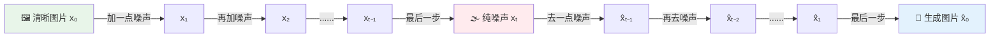
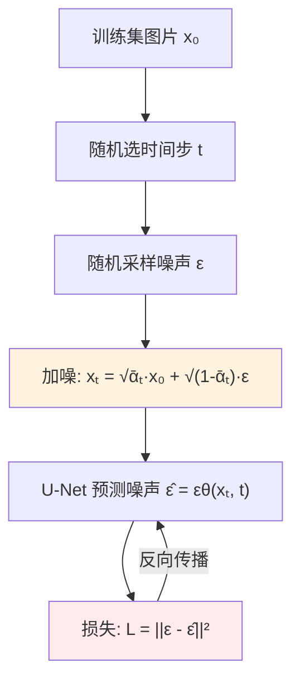
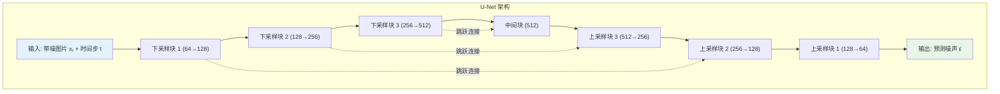
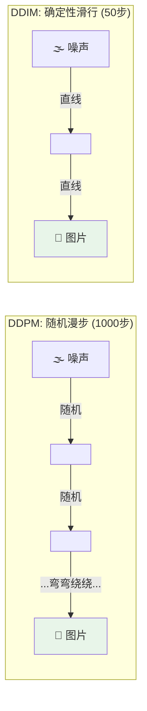
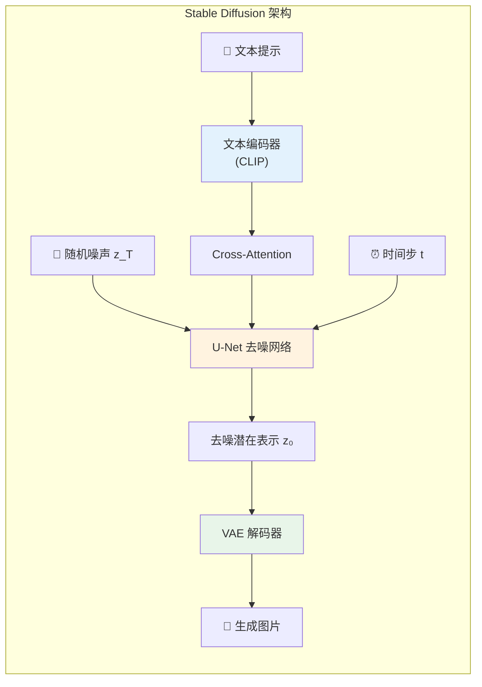
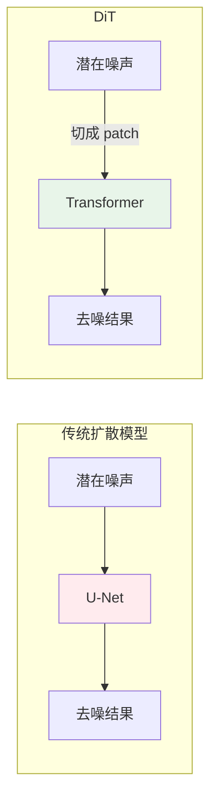
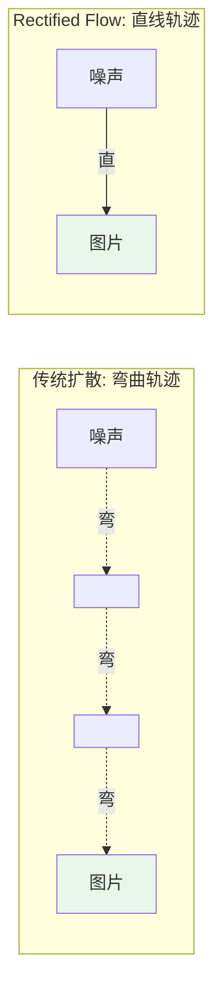
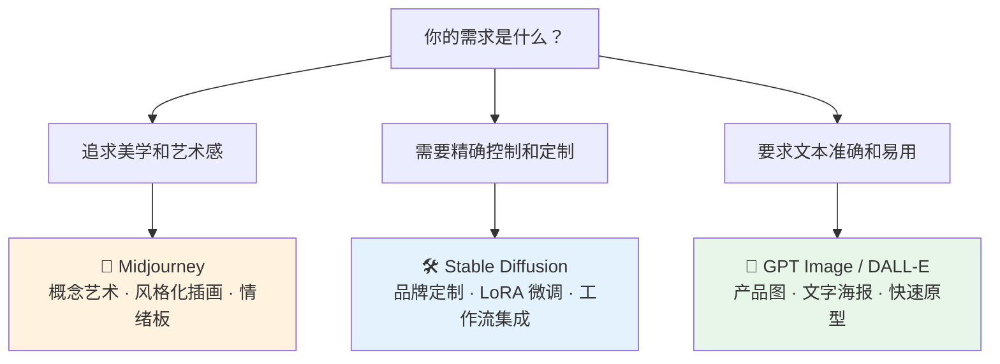
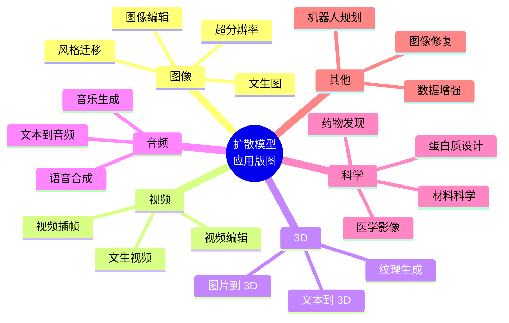
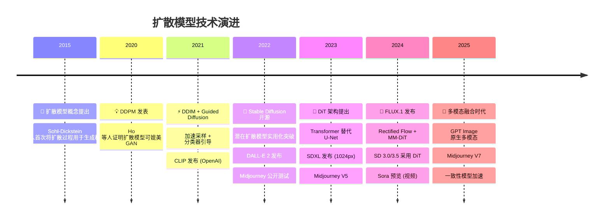

# 扩散模型深度解析：从噪声中生长出的艺术

> 从 DDPM 的"破坏与重建"哲学，到 Stable Diffusion 的潜在空间魔法，再到 DiT、FLUX 的 Transformer 革命——用直觉和类比，带你真正理解扩散模型家族的技术原理、主流代表与应用场景。

## 引言

想象你手握一张精美的油画，然后开始往上面泼沙子——一把、两把、三把……直到整幅画被厚厚的沙子完全覆盖，看不出任何图案。现在，挑战来了：**能不能训练一个 AI，让它学会一把一把地把沙子扫走，最终还原出那幅油画？**

更神奇的是——如果 AI 真的学会了"扫沙子"的技巧，那给它一堆**全新的、随机撒的沙子**，它能不能"扫"出一幅**从未存在过**的新画？

答案是**可以**。这就是**扩散模型（Diffusion Model）** 的核心思想。

2020 年，DDPM 横空出世；2022 年，Stable Diffusion 让 AI 绘画走进千家万户；2023 年至今，DiT 和 FLUX 用 Transformer 重新定义了这个赛道。扩散模型已经成为当下最强大的图像生成范式——没有之一。

本文将用生动的类比 + 深入的原理，带你走进扩散模型家族的技术世界。

---

## 一、扩散模型的核心思想：破坏容易，修复见功夫

### 1.1 一个直觉：倒放的破坏过程就是创造

扩散模型的灵感来自物理学中的**热力学扩散**——一滴墨水落入清水，会逐渐扩散开，最终变成均匀的淡色。这个过程是自发的、不可逆的。但如果你**把这个过程拍成视频然后倒放**——你会看到均匀的淡色液体神奇地自动聚集成一滴墨水！

扩散模型做的就是类似的事：

1. **正向过程（加噪）**：把一张清晰图片一步步"破坏"为纯噪声——就像墨水扩散
2. **反向过程（去噪）**：训练神经网络学会"倒放视频"——从噪声中一步步恢复出清晰图片



关键洞察：**正向过程是简单的（只需要按公式加噪声），反向过程才是困难的（需要神经网络学习）**。就像拆掉一栋房子很简单，但从一堆废墟中重建，那才需要真本事。

### 1.2 为什么不直接"一步到位"？

你可能会问：为什么要这么麻烦，一步步去噪？直接从噪声"一步"生成图片不行吗？

想象你是一个雕塑家。给你一块大理石（噪声），让你一刀切出维纳斯——这太难了。但如果允许你**一刀一刀慢慢雕**——先粗略刻出人形，再雕出五官，最后打磨细节——这就容易多了。

扩散模型的多步去噪正是这个道理：每一步只需要做**微小的、局部的调整**，而不需要一次性解决整个生成问题。这大大降低了每一步的难度。

---

## 二、DDPM：扩散模型的奠基之作

**DDPM（Denoising Diffusion Probabilistic Models）** 由 Ho 等人在 2020 年提出，是现代扩散模型的奠基之作。它第一次证明了：基于去噪的生成模型可以匹敌甚至超越 GAN 的图像质量。

### 2.1 正向过程：一步步把图片变成噪声

正向过程是一个**马尔可夫链**——每一步只依赖上一步的结果，与更早的历史无关。在每一步 t，我们按照如下公式往图片上叠加高斯噪声：

```
q(xₜ | xₜ₋₁) = N(xₜ; √(1-βₜ) · xₜ₋₁, βₜ · I)
```

其中 βₜ 是一个预先设定的"噪声调度表"，控制每一步加多少噪声。通常 β 从很小（如 0.0001）逐渐增大到较大（如 0.02）。

用大白话说：**每一步保留原图的一部分，再叠加一些新噪声**。随着步数增加，原图的信息越来越少，噪声越来越多，最终趋近于纯粹的高斯噪声。

一个非常优美的数学性质是：我们可以**跳过中间步骤，直接从 x₀ 算出任意步的 xₜ**：

```
xₜ = √ᾱₜ · x₀ + √(1-ᾱₜ) · ε,    ε ~ N(0, I)
```

其中 ᾱₜ = α₁ · α₂ · ... · αₜ，αₜ = 1 - βₜ。这个公式就像一个"时间快进键"——想知道图片在第 500 步长什么样？一步就能算出来，不用真的跑 500 次。

### 2.2 反向过程：训练神经网络"扫沙子"

反向过程的目标是学习 q(xₜ₋₁ | xₜ) —— 给定一张带噪声的图片 xₜ，还原出噪声稍少一点的 xₜ₋₁。

DDPM 的核心发现是：**与其让网络预测去噪后的图片，不如让它预测当前图片中的噪声成分 ε**。

为什么预测噪声比预测图片更好？回到雕塑的类比：与其告诉雕塑家"最终的维纳斯长什么样"，不如告诉他"这块多余的大理石在哪里，敲掉它"。后者是更简单、更局部的任务。

训练目标极其简洁：

```
L = E[|| ε - εθ(xₜ, t) ||²]
```

翻译成人话：从训练集里取一张图 x₀，随机选一个时间步 t，加噪得到 xₜ，让神经网络 εθ 预测你加进去的噪声 ε，用**均方误差**衡量预测得准不准。就这么简单。



### 2.3 U-Net：扩散模型的"工作马"

DDPM 采用的骨干网络是 **U-Net**——一个经典的编码器-解码器架构，形似字母 U：



- **下采样路径**（左半边）：逐步压缩图像分辨率，提取高层语义特征——"看懂整体布局"
- **上采样路径**（右半边）：逐步恢复分辨率，重建精细细节——"画出每个像素"
- **跳跃连接**（中间的虚线）：把低层细节"快递"到高层，避免在压缩过程中丢失——"同时看到森林和树木"

时间步 t 通过 **正弦位置编码（Sinusoidal Embedding）** 注入网络，告诉网络"现在是在第几步去噪"，因为不同步骤的去噪策略是不同的——早期去噪需要关注全局结构，后期去噪侧重细节修复。

### 2.4 DDPM 的成就与局限

**成就**：

- 首次证明扩散模型可以生成高质量图像（FID 分数与 GAN 媲美）
- 训练过程稳定，不像 GAN 那样容易"模式崩塌"
- 支持多样性生成——同一个提示可以产出风格各异的结果

**局限**：

- **采样速度太慢**！典型的 DDPM 需要 1000 步去噪才能生成一张图，每一步都要跑一次完整的 U-Net 前向传播。生成一张 256×256 的图可能需要几十秒
- 直接在**像素空间**操作，分辨率越高，计算量越爆炸

---

## 三、DDIM：给采样过程装上"快进键"

DDPM 的 1000 步采样实在太慢了。2021 年，Song 等人提出了 **DDIM（Denoising Diffusion Implicit Models）**，用一个精妙的数学技巧大幅加速了采样过程。

### 3.1 核心思想：从"随机漫步"到"确定性滑行"

DDPM 的每一步去噪都要加入随机噪声——就像一个醉汉在迷宫里随机摸索出路，虽然最终能出去，但走了很多弯路。

DDIM 的洞察是：**可以把去噪过程变成确定性的**——不再掷骰子，而是沿着一条确定的轨迹"滑行"到目标。这就像在迷宫里装了导航仪，走直线出去。



### 3.2 实际效果

DDIM 可以在**仅 50 步甚至 20 步**的情况下生成质量接近 DDPM 1000 步的图像——速度提升 **20-50 倍**！

此外，DDIM 还带来了一个意外的好处：**确定性映射**。同一个初始噪声，DDIM 总是生成同一张图片。这使得我们可以在潜在空间中做有意义的插值——比如在两张人脸之间平滑过渡。

---

## 四、Stable Diffusion（LDM）：让扩散模型"飞入寻常百姓家"

DDPM 和 DDIM 虽然在学术上很成功，但有一个致命的实际问题：它们直接在**像素空间**操作。一张 512×512 的 RGB 图片有 786,432 个像素值，每一步去噪都要处理这么大的张量——计算量和显存需求巨大。

2022 年，Rombach 等人提出了 **LDM（Latent Diffusion Models）**，并开源为 **Stable Diffusion**，彻底改变了游戏规则。

### 4.1 核心创新：在"压缩世界"里做扩散

Stable Diffusion 的核心思路令人拍案叫绝：

> **不要在像素空间做扩散，先把图片"压缩"到一个低维的潜在空间（Latent Space），在那里做扩散，最后再"解压"回像素空间。**

这就好比：你要在一张 4K 照片上画画，太费劲了。不如先把照片缩小成缩略图，在缩略图上画，画完再放大回去。


**计算量对比**：

| 方案                         | 操作空间  | 数据维度 | 相对计算量 |
| ---------------------------- | --------- | -------- | ---------- |
| DDPM（像素空间）             | 512×512×3 | 786,432  | 100%       |
| Stable Diffusion（潜在空间） | 64×64×4   | 16,384   | **~2%**    |

在潜在空间做扩散，计算量降低了约 **48 倍**！这意味着普通消费级显卡（如 RTX 3060）就能在几秒内生成高质量图片。

### 4.2 三大组件：各司其职

Stable Diffusion 由三个模块协同工作：



**1. VAE（变分自编码器）——图像的"压缩-解压引擎"**

VAE 的编码器把 512×512 的图片压缩为 64×64 的潜在表示，解码器再把它还原回来。这个 VAE 是**预训练好的**，在扩散过程中参数冻结。（关于 VAE 的详细原理，请参见本系列的 [VAE 深度解析](/canvasflow/topics/image/vae-deep-dive)）

**2. U-Net——扩散的"大脑"**

在潜在空间中执行去噪操作。与 DDPM 的 U-Net 相比，最重要的升级是引入了 **Cross-Attention 机制**——让图片生成过程可以"听从"文本指令。

Cross-Attention 的工作方式：

- **Query（Q）**：来自图像特征——"我这个像素位置需要什么内容？"
- **Key（K）和 Value（V）**：来自文本编码——"文本描述中有哪些信息可以用？"
- 通过 Q 和 K 的相似度匹配，决定每个位置应该关注文本的哪些部分

**3. 文本编码器（CLIP）——语言的"翻译官"**

把人类的自然语言提示（如"一只在雪地里奔跑的金毛犬，电影级画质"）翻译为数值向量，供 U-Net 通过 Cross-Attention 消化理解。

### 4.3 Classifier-Free Guidance：平衡创意与服从

生成图片时，有一个关键参数叫 **CFG Scale（引导系数）**，它控制"图片多大程度上服从文本描述"：

```
输出 = 无条件预测 + CFG_Scale × (有条件预测 - 无条件预测)
```

| CFG Scale | 效果                       | 类比                             |
| --------- | -------------------------- | -------------------------------- |
| 1         | 完全自由发挥，多样性极高   | 画师随心所欲地画                 |
| 7-8       | 平衡服从性和创意（常用值） | 画师根据描述画，但有自己的理解   |
| 15+       | 严格遵守文本，但可能过饱和 | 画师一字不差地照搬描述，失去灵气 |

### 4.4 Stable Diffusion 的版本演进

| 版本       | 年份 | 关键进步                           |
| ---------- | ---- | ---------------------------------- |
| SD 1.5     | 2022 | 开源里程碑，CLIP 文本编码          |
| SD 2.0/2.1 | 2022 | OpenCLIP，更大分辨率（768px）      |
| SDXL       | 2023 | 双文本编码器，重构 U-Net，1024px   |
| SD 3.0/3.5 | 2024 | **DiT 架构**，MM-DiT，三文本编码器 |

---

## 五、DiT：用 Transformer 重新定义扩散模型

### 5.1 从 U-Net 到 Transformer 的范式转移

2023 年，Peebles 和 Xie 提出了 **DiT（Diffusion Transformer）**，把扩散模型的骨干网络从 U-Net 替换为 **Vision Transformer（ViT）**。

为什么要做这个替换？U-Net 虽然好用，但它就像一把"瑞士军刀"——功能全面但每样都不是最强。Transformer 则像一台"可扩展的超级计算机"——模型越大、数据越多，性能提升就越明显（scaling law）。



### 5.2 DiT 的工作流程

1. **Patch 化**：把潜在表示切成一个个小方块（如 2×2），每个方块展平为一个 token——和 ViT 处理图片的方式一模一样
2. **加入位置编码**：告诉 Transformer 每个 patch 在图片中的位置
3. **Transformer Block 处理**：多层 Self-Attention + FFN，每一层都注入时间步 t 和条件信息
4. **还原**：把处理后的 token 重新拼回潜在表示的形状

### 5.3 为什么 DiT 更强？

- **Scaling Law 生效**：U-Net 在增大参数后收益递减，DiT 则"越大越强"
- **统一架构**：文本、图像、时间步都变成 token 序列，用同一套 Attention 机制处理
- **灵活的条件注入**：通过 AdaLN-Zero（自适应层归一化）优雅地注入条件信息
- **社区与生态**：Transformer 的工程生态（FlashAttention、分布式训练等）更成熟

DiT 的成功直接催生了后续的 Sora（视频生成）、SD 3.0 等重要模型。

---

## 六、FLUX：新一代开源旗舰

### 6.1 FLUX 是谁？

**FLUX.1** 由 **Black Forest Labs** 于 2024 年发布。Black Forest Labs 的创始团队包括 Robin Rombach——正是 Stable Diffusion 的核心作者。可以说，FLUX 是 Stable Diffusion 的"精神续作"。

### 6.2 技术架构亮点

FLUX 在 DiT 的基础上做了多项革新：

**1. Rectified Flow（整流流匹配）**

传统扩散模型的采样轨迹是弯曲的——就像在山路上开车，弯弯绕绕。Rectified Flow 的核心思想是**把轨迹"拉直"**——从噪声到图片走一条尽可能直的路径。



直线轨迹意味着更少的采样步数就能达到高质量——FLUX [schnell] 版本仅需 **4 步**即可生成图片！

**2. 双文本编码器（CLIP + T5-XXL）**

- **CLIP**：擅长理解图文对齐的语义
- **T5-XXL**：擅长理解复杂的长文本和语法结构

两者配合，让 FLUX 对复杂提示词的理解能力远超前代模型——包括**图片中的文字渲染**，这一直是扩散模型的"老大难"问题。

**3. MM-DiT（多模态 DiT）**

FLUX 使用的不是普通的 DiT，而是 **MM-DiT（Multimodal DiT）**——图像 token 和文本 token 在同一个 Transformer 中交互，而不是通过 Cross-Attention"隔空对话"。这让文图理解更加深入。

### 6.3 FLUX 模型家族

| 变体             | 参数量      | 许可证     | 特点                    |
| ---------------- | ----------- | ---------- | ----------------------- |
| FLUX.1 [pro]     | 12B+        | API-only   | 最高质量，仅限 API 调用 |
| FLUX.1 [dev]     | 12B         | 非商业     | 开放权重，社区研究      |
| FLUX.1 [schnell] | 12B（蒸馏） | Apache 2.0 | 仅需 4 步，完全开源     |

---

## 七、主流产品对比：三足鼎立

扩散模型技术催生了三大主流产品，各有千秋：

### 7.1 全景对比

| 维度         | Stable Diffusion    | Midjourney      | DALL-E / GPT Image       |
| ------------ | ------------------- | --------------- | ------------------------ |
| **开发商**   | Stability AI / 社区 | Midjourney Inc. | OpenAI                   |
| **开源性**   | 完全开源            | 闭源            | 闭源                     |
| **架构**     | LDM → DiT（SD3）    | 自研扩散模型    | CLIP + 扩散 → 原生多模态 |
| **最新版本** | SD 3.5（2024）      | V7（2025）      | GPT Image 1.5（2025）    |
| **核心优势** | 极致灵活性、可定制  | 美学品质最高    | 文本理解最强             |
| **运行方式** | 本地部署 / 云端     | 云端（Web/App） | ChatGPT 集成             |
| **上手难度** | ⭐⭐⭐⭐            | ⭐⭐            | ⭐                       |

### 7.2 谁适合谁？



---

## 八、超越图片：扩散模型的应用版图

扩散模型的"从噪声中恢复信号"这一思想，远不止于生成图片。它正在渗透到越来越多的领域。

### 8.1 视频生成

视频本质上是"带时间维度的图片序列"。扩散模型扩展到视频领域，需要在空间去噪的基础上加入**时序一致性**——确保前后帧之间是连贯的。

代表性工作：

- **Sora**（OpenAI）：基于 DiT 架构，直接在时空 patch 上做扩散，可以生成长达 1 分钟的高质量视频
- **Stable Video Diffusion**（Stability AI）：从 Stable Diffusion 扩展而来，支持图生视频
- **Runway Gen-3**：面向创意工作者的商业视频生成平台
- **Kling / 可灵**（快手）、**Vidu**（生数科技）：国内代表性视频生成模型

### 8.2 3D 内容生成

扩散模型与 NeRF、3D Gaussian Splatting 等技术结合，可以从文本或图片生成 3D 模型：

- **DreamFusion**（Google）：通过 SDS（Score Distillation Sampling）用 2D 扩散模型指导 3D 生成
- **Magic3D**（NVIDIA）：两阶段粗到细的 3D 生成
- **Point-E / Shap-E**（OpenAI）：直接生成 3D 点云或隐式表面
- **Zero-1-to-3**：从单张图片重建 3D 模型

### 8.3 音频与音乐

声音的频谱图其实就是一种"图片"——扩散模型天然适合处理：

- **AudioLDM**：在音频潜在空间做扩散，实现文本到音频生成
- **MusicGen**（Meta）/ **Suno** / **Udio**：AI 音乐生成平台
- **Bark**：文本到语音，支持多种语言和音效

### 8.4 医学影像

扩散模型在医学领域有独特价值：

- **合成数据生成**：生成高质量的 CT、MRI、X 光合成图像，解决医学数据稀缺和隐私问题
- **图像增强**：低剂量 CT 去噪、MRI 超分辨率
- **跨模态转换**：从 MRI 生成对应的 CT 图像，减少患者重复检查
- **异常检测**：用扩散模型学习"正常"分布，偏离该分布的即为异常

### 8.5 分子设计与药物发现

扩散模型的"从噪声中生成结构"的能力，天然适用于分子生成：

- **RFdiffusion**（Baker Lab）：基于扩散的蛋白质结构设计，已用于设计全新的功能性蛋白质
- **DiffDock**：预测药物分子与蛋白质靶点的对接构象
- **分子生成**：设计具有特定属性（溶解度、活性等）的新型药物分子

### 8.6 应用全景图



---

## 九、技术演进时间线



---

## 十、总结与展望

### 10.1 核心要点回顾

| 模型                 | 核心贡献         | 一句话总结                             |
| -------------------- | ---------------- | -------------------------------------- |
| **DDPM**             | 奠定理论基础     | 证明"从噪声去噪"可以生成高质量图片     |
| **DDIM**             | 加速采样         | 把 1000 步压缩到 50 步，速度提升 20 倍 |
| **Stable Diffusion** | 潜在空间扩散     | 把扩散搬到"压缩世界"，计算量骤降 48 倍 |
| **DiT**              | Transformer 骨干 | 让扩散模型也能"越大越强"               |
| **FLUX**             | 整流流 + MM-DiT  | 4 步出图，文字渲染能力跃升             |

### 10.2 未来趋势

1. **更少步数，更高质量**：一致性模型（Consistency Models）等技术正在将采样步数压缩到 1-4 步
2. **多模态融合**：图像、视频、3D、音频的生成正在走向统一架构
3. **原生多模态**：像 GPT Image 那样，图像生成能力直接嵌入大语言模型
4. **垂直行业落地**：医疗、制药、工业设计等领域的专用扩散模型将越来越多
5. **端侧部署**：模型蒸馏和量化技术让扩散模型在手机等边缘设备上运行成为可能

扩散模型的故事还远未结束。从一个物理学启发的优美概念，到改变全人类创作方式的核心技术——它的每一步演进，都在拓宽 AI 创造力的边界。

---

## 参考资料

1. Ho, J., Jain, A., & Abbeel, P. (2020). [Denoising Diffusion Probabilistic Models](https://arxiv.org/abs/2006.11239). NeurIPS 2020.
2. Song, J., Meng, C., & Ermon, S. (2021). [Denoising Diffusion Implicit Models](https://arxiv.org/abs/2010.02502). ICLR 2021.
3. Rombach, R., et al. (2022). [High-Resolution Image Synthesis with Latent Diffusion Models](https://arxiv.org/abs/2112.10752). CVPR 2022.
4. Peebles, W. & Xie, S. (2023). [Scalable Diffusion Models with Transformers](https://arxiv.org/abs/2212.09748). ICCV 2023.
5. Black Forest Labs. (2024). [FLUX.1 Technical Report](https://blackforestlabs.ai/).
6. [深入浅出扩散模型系列 - 知乎](https://zhuanlan.zhihu.com/p/650394311)
7. [从 DDPM 到 Stable Diffusion 再到 DiT 的技术演进 - 博客园](https://www.cnblogs.com/yangykaifa/p/19460814)
8. [扩散模型详解 - SegmentFault](https://segmentfault.com/a/1190000043744225)
9. [Diffusion Models Demystified - KDnuggets](https://www.kdnuggets.com/diffusion-models-demystified-understanding-the-tech-behind-dall-e-and-midjourney)
10. [Midjourney vs DALL-E 3 vs Stable Diffusion: 2025 AI Image Generation](https://vertu.com/lifestyle/midjourney-vs-dall-e-3-vs-stable-diffusion-2025-ai-image-generation/)
