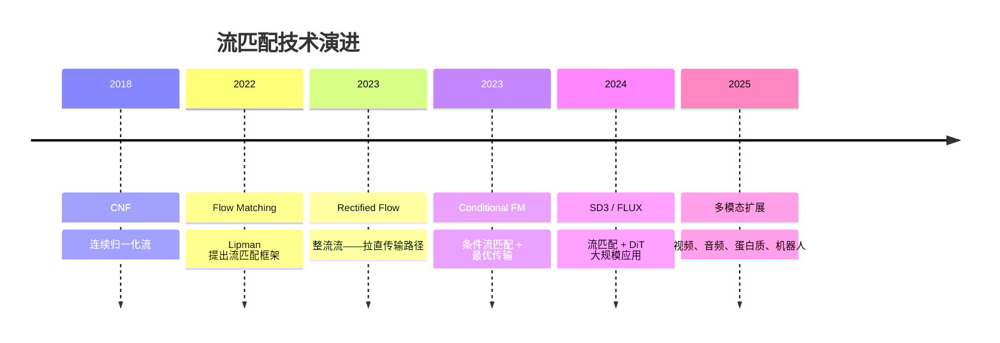
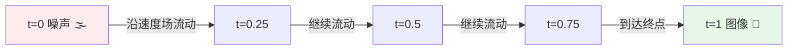
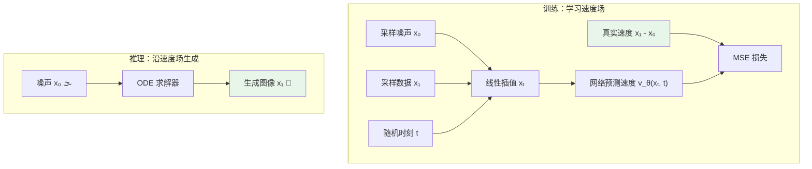
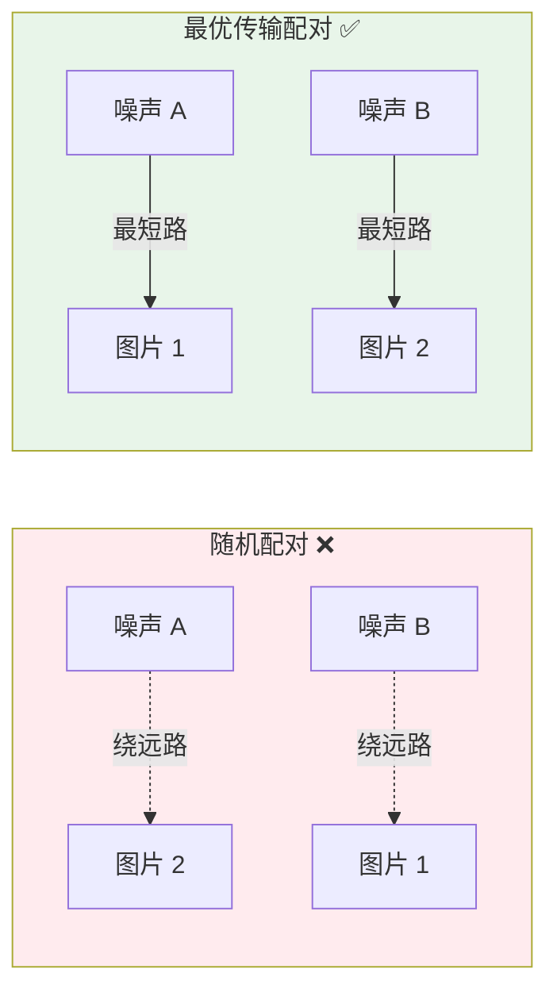
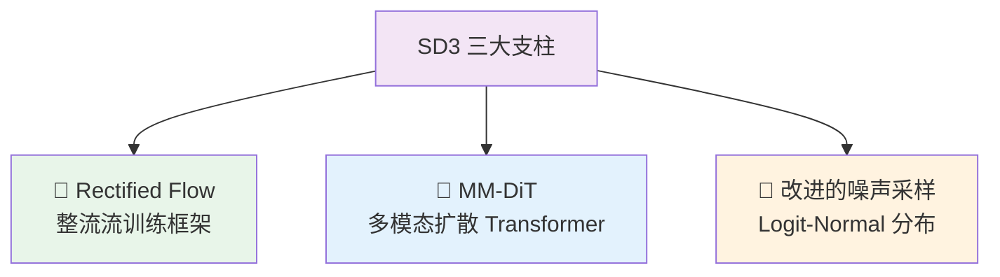
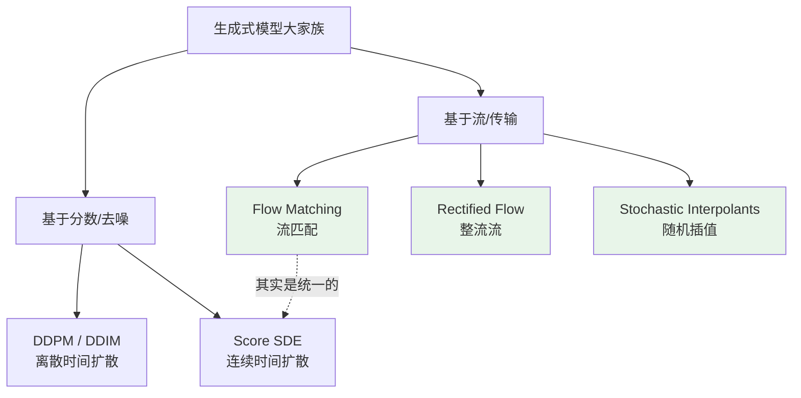

# 流匹配深度解析：从理论突破到 Stable Diffusion 3 与 FLUX

> 从弯弯曲曲的扩散路径到一条笔直的高速公路——流匹配（Flow Matching）如何用最简单的直觉，革新了整个生成式 AI 的底层范式。

## 引言

假设你要从北京去上海。

**扩散模型**的方式是：先把你丢到一片完全未知的荒野（纯噪声），然后让你一步步摸索，走一条弯弯曲曲的小路，经过无数次拐弯、回头，最终到达上海（目标图像）。这条路虽然一定能走到，但弯弯绕绕，走起来很慢。

**流匹配**的方式是：直接修一条从北京到上海的**高速公路**——笔直、畅通、一脚油门就到。

这就是流匹配（Flow Matching）的核心直觉：**学习一条从噪声到数据的最短、最直的路径**。它用更简单的数学、更直的轨迹、更少的采样步数，达到了与扩散模型同级甚至更好的生成效果。

2024 年以来，Stable Diffusion 3、FLUX、Sora、Voicebox 等明星产品纷纷采用流匹配作为核心生成框架。它正在成为生成式 AI 的新基石。

本文将用生动的类比 + 深入的原理，带你真正理解流匹配家族的技术世界。



## 一、为什么需要流匹配：扩散模型的"弯路"问题

### 1.1 回顾扩散模型：一场漫长的去噪旅程

扩散模型的工作方式就像一个"加噪 → 去噪"的过程：

1. **前向过程**：对一张清晰图片逐步添加高斯噪声，直到变成完全随机的噪声
2. **反向过程**：训练一个神经网络，学会逐步去噪，从噪声还原出图片

这套方法非常有效——DALL-E 2、Stable Diffusion 1.x/2.x、Midjourney 都是基于此。但它有几个固有的缺点：

| 痛点         | 原因                                     | 后果                              |
| ------------ | ---------------------------------------- | --------------------------------- |
| 采样慢       | 去噪路径弯曲，需要 20-50 步              | 生成一张图要好几秒                |
| 训练目标复杂 | 需要精心设计噪声调度表（noise schedule） | 调参困难，不同任务要不同 schedule |
| 理论框架重   | 依赖随机微分方程（SDE）                  | 理解和实现都不简单                |

打个比方：扩散模型像是在迷宫里走——虽然保证能走出去，但路线曲折，每走一步都需要犹豫和调整方向。

### 1.2 我们真正想要的是什么

理想的生成过程应该像这样：

> 从噪声（起点）到图像（终点），走一条**最短的直线**，**一步到位**。

这就是流匹配想要实现的目标。它不在意"噪声是怎么加上去的"，只关心"怎样用最短的路径把噪声变成图像"。

## 二、连续归一化流：流匹配的数学地基

### 2.1 什么是"流"

在数学中，**流（Flow）** 描述的是一个粒子在速度场中的运动轨迹。

想象一条河流：水面上每一个点都有一个速度方向（流速和流向），一片树叶放在水面上就会沿着水流运动。如果你知道每个位置、每个时刻的水流速度，就能精确预测树叶从起点飘到终点的路径。

**连续归一化流（Continuous Normalizing Flow, CNF）** 把这个想法用在了生成模型上：

- **树叶** = 数据样本（图片）
- **河流** = 一个随时间变化的速度场
- **起点** = 噪声分布（高斯噪声）
- **终点** = 数据分布（真实图片）

速度场由一个神经网络参数化，描述为一个**常微分方程（ODE）**：

```
dx/dt = v_θ(x, t)
```

其中 `v_θ` 是神经网络预测的速度场，`x` 是当前位置（图像状态），`t` 是时间（从 0 到 1）。



### 2.2 CNF 的老问题：训练太贵

CNF 的想法虽好，但传统训练方法需要在训练过程中**模拟整条 ODE 轨迹**——相当于你要先让树叶从头飘到尾，才能根据结果调整河流的方向。

这在计算上极其昂贵，限制了 CNF 在大规模任务上的应用。

**流匹配的突破在于**：找到了一种无需模拟 ODE 就能训练 CNF 的方法。

## 三、流匹配：用"直觉"训练"河流"

### 3.1 核心思想：一个令人拍案叫绝的简化

流匹配的训练策略可以用一个超级直觉的比喻来理解：

> 你想修一条从北京到上海的高速公路（全局速度场）。直接规划全国路网太复杂了。
>
> 但每一辆已经在路上的车，你都**知道它现在该往哪个方向开**——因为你知道它从哪来（噪声样本 x₀），要去哪（数据样本 x₁），现在走到了哪（时刻 t 的位置 xₜ）。
>
> 所以，你只需要训练一个导航系统：**在每个位置、每个时刻，预测正确的行驶方向**。当这个导航系统学会了所有车的方向，全国的高速公路网络就自动修好了。

技术上说，这就是**条件流匹配（Conditional Flow Matching）**的核心思路。

### 3.2 三步理解流匹配训练

**第一步：定义"每辆车的路线"（条件概率路径）**

给定一个噪声样本 x₀ 和一个真实数据样本 x₁，定义一条从 x₀ 到 x₁ 的路径：

```
xₜ = (1 - t) · x₀ + t · x₁
```

这就是一条**笔直的线性插值路径**——在 t=0 时是纯噪声，t=1 时是真实数据，中间是两者的平滑混合。

这条路径上每个点的"速度"（方向）是什么？对 t 求导：

```
dxₜ/dt = x₁ - x₀
```

**简单得令人难以置信**：速度就是终点减去起点，一个常数向量！方向始终指向目标，永不拐弯。

**第二步：训练神经网络匹配这些速度（流匹配损失）**

训练目标极其简单——让神经网络预测的速度 `v_θ(xₜ, t)` 尽可能接近真实速度 `x₁ - x₀`：

```
L = E_{t, x₀, x₁} || v_θ(xₜ, t) - (x₁ - x₀) ||²
```

翻译成大白话：

1. 随机选一个时刻 t
2. 随机配对一个噪声 x₀ 和一个真实图片 x₁
3. 算出此刻的位置 xₜ = (1-t)·x₀ + t·x₁
4. 让网络看着 xₜ 和 t，预测应该往哪走
5. 跟正确答案 x₁ - x₀ 比较，算损失

**不需要模拟 ODE，不需要复杂的噪声调度，不需要 SDE 理论**。整个训练过程简洁到令人拍案。

**第三步：推理时沿速度场"流动"**

训练好后，生成图像只需：

1. 从高斯分布采一个噪声 x₀
2. 用 ODE 求解器沿着学到的速度场积分：x₀ → x₁
3. 由于路径接近直线，只需很少的步数（甚至 1 步）就能到达



### 3.3 与扩散模型的训练对比

| 方面       | 扩散模型                          | 流匹配                       |
| ---------- | --------------------------------- | ---------------------------- |
| 前向过程   | 逐步加噪（马尔可夫链）            | 线性插值（直线路径）         |
| 训练目标   | 预测噪声 ε 或分数函数             | 预测速度场 v                 |
| 噪声调度   | 需要精心设计 β schedule           | 自然由插值定义，无需额外设计 |
| 采样路径   | 弯曲，需要多步纠正                | 近似直线，少步高质量         |
| 数学框架   | SDE/分数匹配（较重）              | ODE/速度回归（较轻）         |
| 实现复杂度 | 中等（需处理 schedule、参数化等） | 简单（核心代码不到 20 行）   |

### 3.4 为什么这么简单的方法能 work？

你可能会怀疑：每辆车都走自己的直线，这些直线加在一起就能形成正确的全局速度场？

答案是**可以的**——这背后有严格的数学保证。直觉上理解：

- 当你有足够多的"车"（训练数据对），它们的个体方向的期望就是全局最优方向
- 就像调查 1000 万人的出行方向，就能画出全国交通流量图——个体行为的统计汇总 = 全局规律

这正是 Lipman 等人在 2022 年原论文中证明的核心定理：**条件速度场的边际化等于目标速度场**。

## 四、最优传输：给高速公路选最佳路线

### 4.1 配对问题：谁应该变成谁

在流匹配的训练中，我们需要把噪声样本 x₀ 和数据样本 x₁ **配对**。最简单的做法是随机配对——随机抓一个噪声和一个图片凑一对。

但随机配对可能导致"交通混乱"：

> 想象 100 辆车从北京出发去全国各地。如果随机分配目的地，可能出现北京的 A 车被分配去广州，而北京旁边的 B 车被分配去哈尔滨——路线交叉、效率低下。

**最优传输（Optimal Transport, OT）** 解决的正是这个问题：如何把起点和终点做最优配对，使得所有车的**总路程最短**。

### 4.2 OT 条件流匹配

Tong 等人在 2023 年提出了 **OT-CFM（Optimal Transport Conditional Flow Matching）**，将最优传输引入流匹配：

- **Mini-batch OT**：在每个训练 batch 内，用最优传输算法找到噪声和数据的最佳配对
- **更直的路径**：因为配对更合理，学到的速度场路径更直、交叉更少
- **更快收敛**：模型训练更稳定，需要更少的训练步数



### 4.3 实际效果

使用 OT 配对后：

- **路径更直**：减少了速度场中的交叉和冲突
- **采样步数更少**：相同质量下，步数可减少 2-5 倍
- **FID 更低**：图像质量指标显著提升

## 五、整流流（Rectified Flow）：把弯路"拉直"

### 5.1 核心思想：反复整流

**整流流（Rectified Flow）** 由 Liu 等人在 2022 年提出，是流匹配的一个关键变体。它的核心思想用一句话概括：

> **即使初始学到的路径不够直，也可以通过"再训练"把它拉直。**

这就像修路工程的迭代优化：

1. **第一轮**：先修一条大致可行的路（可能还有些弯道）
2. **第二轮**：用第一轮的路跑一遍，记录下实际轨迹，然后修一条更直的路来连接起点和终点
3. **第三轮**：重复上述过程，路越来越直

技术上，这个过程叫做 **Reflow**：

1. 用当前模型从噪声 x₀ 生成数据 x̂₁（模拟 ODE）
2. 用 (x₀, x̂₁) 作为新的配对，重新训练流匹配模型
3. 重复若干轮

每一轮 Reflow 都会让传输路径更直，直到接近理想的直线传输。

### 5.2 为什么"直"这么重要

路径的直线程度直接决定了采样需要多少步：

| 路径形状 | 所需步数  | 类比         |
| -------- | --------- | ------------ |
| 高度弯曲 | 50-100 步 | 山路十八弯   |
| 较为弯曲 | 20-50 步  | 乡间小路     |
| 基本笔直 | 4-10 步   | 国道         |
| 完全笔直 | 1 步      | 理想高速公路 |

**如果路径是完美的直线，欧拉法一步就能精确到达终点**——因为直线的速度场是常数，不需要多步逼近。

这就是为什么 Stable Diffusion 3 和 FLUX 能在极少步数下生成高质量图像——它们底层的 Rectified Flow 把路拉得足够直了。

### 5.3 Rectified Flow 的数学优雅

整流流有一个漂亮的理论性质：每一轮 Reflow 都**单调减少传输代价**——路只会越来越直，不会越修越弯。

这保证了迭代优化的收敛性。实际应用中，通常 1-2 轮 Reflow 就足够让路径变得很直了。

## 六、Stable Diffusion 3：流匹配的里程碑

### 6.1 SD3 做了什么

**Stable Diffusion 3**（Esser et al., 2024）是流匹配在大规模文生图中的第一个标志性应用。它的架构可以概括为三大支柱：



**支柱一：Rectified Flow 训练框架**

SD3 抛弃了传统扩散模型的 DDPM/DDIM 框架，采用 Rectified Flow 作为核心生成范式：

- 训练目标：预测速度场 v（而非噪声 ε）
- 传输路径：近似直线（从噪声到数据）
- 采样方式：ODE 求解，步数大幅减少

**支柱二：MM-DiT（Multimodal Diffusion Transformer）**

SD3 还升级了网络架构，从 UNet 换成了 **Transformer**：

| 组件     | SD 1.x/2.x      | SD3                             |
| -------- | --------------- | ------------------------------- |
| 骨干网络 | UNet            | MM-DiT (Transformer)            |
| 文本编码 | CLIP            | CLIP + T5-XXL 双编码器          |
| 文图交互 | Cross-Attention | 文本与图像 token 联合 Attention |
| 参数规模 | ~1B             | 2B / 8B                         |

MM-DiT 的关键创新是将文本 token 和图像 token **放在同一个 Transformer 序列中**联合处理，而不是通过 Cross-Attention 间接交互。这大幅提升了文本理解和遵循能力——尤其是拼写、空间关系等精细控制。

**支柱三：改进的噪声采样**

传统扩散模型均匀采样时间步 t。但 SD3 发现：**中间时刻（t ≈ 0.5）的训练信号最丰富**——因为此时图像既不是纯噪声（太简单）也不是几乎干净（没什么可学的）。

因此 SD3 使用 **Logit-Normal 分布** 对时间步采样，让训练更多关注中间时刻：

```
t ~ σ(Normal(0, 1))  // σ 是 sigmoid 函数
```

这个看似微小的改进，带来了显著的训练效率提升。

### 6.2 SD3 的效果

与前代相比，SD3 在以下方面实现了飞跃：

- **文字渲染**：首次能够在图像中生成可读的文字（得益于 T5 文本编码器 + 联合 Attention）
- **空间理解**："一只猫坐在一条狗的左边"——准确遵循空间指令
- **采样效率**：20-30 步即可生成高质量图像（SD 1.x 通常需要 50 步）
- **可扩展性**：从 800M 到 8B 参数，效果随规模稳定提升

## 七、FLUX：流匹配的集大成者

### 7.1 从 SD3 到 FLUX

**FLUX** 由 **Black Forest Labs**（BFL）开发——这是一家由 Stable Diffusion 核心团队（包括 Robin Rombach 等人）创立的公司。FLUX 可以看作是 SD3 架构的**继承与精炼**。

### 7.2 FLUX 家族

| 模型             | 定位     | 特点                      |
| ---------------- | -------- | ------------------------- |
| FLUX.1 [pro]     | 商业闭源 | 最高质量，API 访问        |
| FLUX.1 [dev]     | 开放权重 | 质量接近 pro，可本地运行  |
| FLUX.1 [schnell] | 极速开源 | 仅需 1-4 步，适合实时应用 |

### 7.3 FLUX 的技术改进

FLUX 在 SD3 的基础上做了多项优化：

**改进的 DiT 架构**：在 MM-DiT 基础上，FLUX 对 Transformer 块做了进一步优化，包括更高效的注意力计算和位置编码方案。

**蒸馏加速（Schnell 版本）**：FLUX.1 [schnell] 通过知识蒸馏，将多步模型压缩为 1-4 步的快速版本——速度接近实时，质量仍然出色。

**更好的美学质量**：FLUX 生成的图像在构图、光影、细节方面普遍优于 SD3，被广泛认为是 2024 年最强的开放文生图模型之一。

### 7.4 FLUX 的实际表现

FLUX 一经发布就在社区引起了轰动。与竞品的对比：

| 模型             | 架构     | 生成范式              | 典型步数 | 质量评价       |
| ---------------- | -------- | --------------------- | -------- | -------------- |
| SD 1.5           | UNet     | DDPM 扩散             | 30-50    | 经典但有局限   |
| SDXL             | UNet     | DDPM 扩散             | 25-40    | 细节提升明显   |
| SD3              | MM-DiT   | Rectified Flow        | 20-30    | 文字渲染突破   |
| FLUX.1 [dev]     | DiT 变体 | Rectified Flow        | 20-30    | 美学质量领先   |
| FLUX.1 [schnell] | DiT 变体 | Rectified Flow + 蒸馏 | 1-4      | 速度与质量兼得 |

## 八、流匹配的更多形态

### 8.1 随机插值（Stochastic Interpolants）

Albergo & Vanden-Eijnden 在 2023 年提出了**随机插值（Stochastic Interpolants）**框架，从另一个数学角度统一了流匹配和扩散模型。

核心思想是：在噪声和数据之间的插值路径上可以加入**受控的随机性**——就像在高速公路上允许小幅变道，增加了生成多样性。

这一框架证明了：流匹配（确定性 ODE）和扩散模型（随机 SDE）其实是同一个大家族的不同成员，可以通过调节随机性的大小在两者之间平滑过渡。

### 8.2 离散流匹配（Discrete Flow Matching）

经典流匹配处理的是连续数据（图像像素值）。但文本、代码等离散数据呢？

**离散流匹配**将连续的速度场推广到**离散状态空间的转移概率**：

- 不再是"往哪个方向移动"，而是"以什么概率跳转到哪个状态"
- 核心思路不变：学习从噪声分布到数据分布的最短路径

这让流匹配可以统一处理图像（连续）和文本（离散），为多模态生成铺平了道路。

### 8.3 黎曼流匹配（Riemannian Flow Matching）

不是所有数据都生活在平坦的欧几里得空间中：

- **蛋白质结构**在特殊的几何流形（SE(3) 群）上
- **球面数据**（地球坐标、分子扭转角）在球面或环面上
- **正定矩阵**在正定锥上

**黎曼流匹配**将流匹配推广到任意黎曼流形上，使得在这些弯曲空间中也能定义"直线"（测地线）路径并进行流匹配训练。

## 九、应用场景：流匹配无处不在

### 9.1 图像生成——主战场

流匹配在图像生成中的应用最为成熟：

- **Stable Diffusion 3 / FLUX**：文生图的新标杆
- **SiT（Scalable Interpolant Transformers）**：Meta 的流匹配图像生成研究
- **Lumina-T2X**：支持多种分辨率和长宽比的流匹配文生图

核心优势：更少的采样步数、更好的图像质量、更强的可扩展性。

### 9.2 视频生成——时间维度的流匹配

视频本质上是时间序列的图像。流匹配天然适合建模这种时空连续变化：

- **Sora（OpenAI）**：据分析，其核心生成框架采用了流匹配或其变体
- **Runway Gen-3 Alpha**：高质量视频生成，背后是流匹配 + DiT 架构
- **Stable Video Diffusion 的后续版本**：逐步从扩散迁移到流匹配

流匹配的直线路径在视频中意味着更好的**时间一致性**——画面不会在帧间莫名跳变。

### 9.3 语音与音频——Meta 的 Voicebox

**Voicebox**（Meta, 2023）是流匹配在语音合成领域的标志性应用：

- 基于条件流匹配（CFM）训练
- 支持零样本语音合成（听几秒就能模仿说话风格）
- 支持语音填充（把一段话中间被噪声遮盖的部分补全）
- 多语言支持（英语、法语、西班牙语等）

类似地，**E2 TTS**（Microsoft）也采用了流匹配做语音合成，展示了这一框架在音频领域的广泛适用性。

### 9.4 蛋白质结构预测——FrameFlow

生物学中的蛋白质设计问题可以建模为：给定功能需求，生成满足条件的 3D 蛋白质结构。

**FrameFlow** 使用黎曼流匹配在 SE(3) 流形（描述 3D 刚体变换的空间）上建模蛋白质骨架的生成过程。相比基于扩散的方法（如 RFDiffusion），流匹配在采样效率和生成质量上都有优势。

### 9.5 机器人动作生成

在具身智能领域，机器人需要根据指令生成连续的动作序列。流匹配可以建模从随机初始化到目标动作轨迹的映射：

- 动作空间是连续的（关节角度、末端位置）
- 需要快速推理（实时控制）
- 路径平滑性很重要（避免突兀的动作跳变）

这些需求恰好是流匹配的强项。

## 十、流匹配 vs 扩散模型：全面对比



| 维度       | 扩散模型                 | 流匹配           |
| ---------- | ------------------------ | ---------------- |
| 理论基础   | SDE / 分数匹配           | ODE / 速度场回归 |
| 前向过程   | 随机加噪（马尔可夫链）   | 确定性线性插值   |
| 训练目标   | 预测噪声 ε 或分数 ∇log p | 预测速度 v       |
| 传输路径   | 弯曲                     | 近似直线         |
| 采样方式   | SDE/ODE 求解器           | ODE 求解器       |
| 典型步数   | 20-50                    | 4-30（可低至 1） |
| 噪声调度   | 需要手动设计             | 自然由插值定义   |
| 理论优雅度 | 较复杂                   | 简洁统一         |
| 离散数据   | 需要特殊处理             | 有自然推广       |
| 非欧空间   | 困难                     | 黎曼流匹配       |

但有一个重要的事实：**流匹配和扩散模型在数学上是可以互相转化的**。

当使用高斯概率路径时，流匹配退化为扩散模型的一种特殊形式。从这个角度看，流匹配更像是扩散模型的一种**更优雅的重新表述**，而非一种完全不同的方法。

正如 Meta AI 的 Yaron Lipman 所说：

> "Flow Matching 为扩散模型提供了一个更简单的视角，并且这个视角自然地引出了更好的设计选择。"

## 十一、展望：流匹配的未来

### 11.1 统一所有生成模式

流匹配正在走向一个宏大的目标：**统一所有模态、所有数据类型的生成建模**。

- **连续数据**：图像、视频、音频、动作 → 经典流匹配
- **离散数据**：文本、代码、分子序列 → 离散流匹配
- **结构化数据**：蛋白质、3D 几何 → 黎曼流匹配
- **混合数据**：图文混合、多模态 → 统一框架

### 11.2 一步生成

通过蒸馏和整流技术，流匹配模型正在趋近于**一步生成**——输入噪声，一步出图。FLUX.1 [schnell] 的 1-4 步生成已经展示了这一方向的可行性。当真正实现一步高质量生成时，AI 绘画将进入实时交互时代。

### 11.3 更高效的训练

流匹配的简洁性使得训练优化有更大的空间。OT 配对、时间步加权、架构搜索等技术的组合，有望进一步降低大规模模型的训练成本。

## 总结

让我们用一段话回顾流匹配的故事：

**2018 年**，连续归一化流（CNF）展示了用 ODE 做生成的美好愿景，但训练太贵。**2022 年**，Lipman 等人提出了流匹配——一种无需模拟 ODE 就能训练 CNF 的优雅方法，核心思想简单到惊人：学习从噪声到数据的直线速度场。**同年**，Liu 等人的整流流（Rectified Flow）进一步将"拉直路径"推向极致。**2023 年**，最优传输配对和条件流匹配让训练更高效、路径更优。**2024 年**，Stable Diffusion 3 和 FLUX 将流匹配推上了工业应用的舞台——从此，AI 图像生成的底层引擎从"去噪扩散"变成了"直线流动"。

今天，从你用 FLUX 生成的一张图片，到 Sora 生成的一段视频，再到 Voicebox 合成的一段语音，背后都有流匹配在默默工作。它不是对扩散模型的否定，而是一次优雅的升华——用更简单的数学，走更直的路，到达更好的目的地。

## 参考文献

- Lipman et al. [Flow Matching for Generative Modeling.](https://arxiv.org/abs/2210.02747) ICLR 2023.
- Liu et al. "Flow Straight and Fast: Learning to Generate and Transfer Data with Rectified Flow." ICLR 2023.
- Tong et al. "Improving and Generalizing Flow-Based Generative Models with Minibatch Optimal Transport." ICML 2024.
- Albergo & Vanden-Eijnden. "Stochastic Interpolants: A Unifying Framework for Flows and Diffusions." ICML 2023.
- Esser et al. "Scaling Rectified Flow Transformers for High-Resolution Image Synthesis." ICML 2024.
- Le Moing et al. [Flow Matching Guide and Code.](https://ai.meta.com/research/publications/flow-matching-guide-and-code/) Meta AI, 2024.
- Cambridge MLG. [An Introduction to Flow Matching.](https://mlg.eng.cam.ac.uk/blog/2024/01/20/flow-matching.html) 2024.
- NeurIPS 2024 Tutorial. [Flow Matching for Generative Modeling.](https://neurips.cc/virtual/2024/tutorial/99531)
