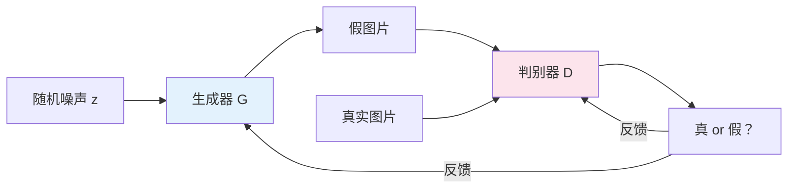
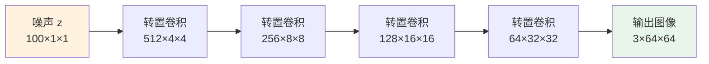
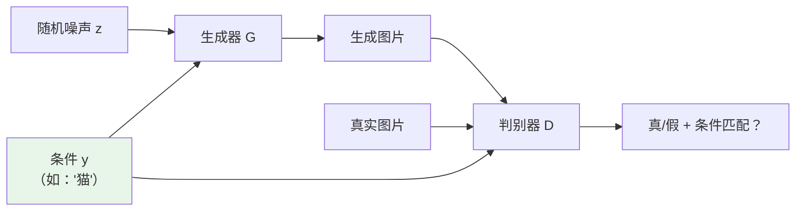
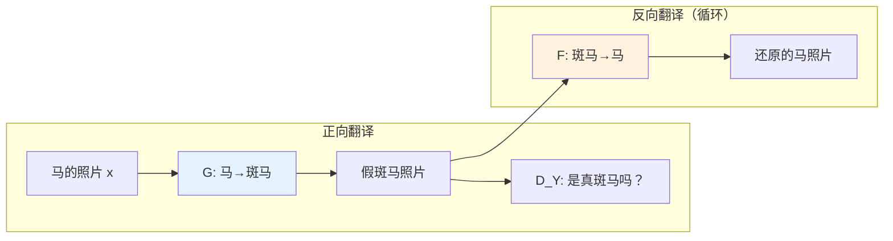
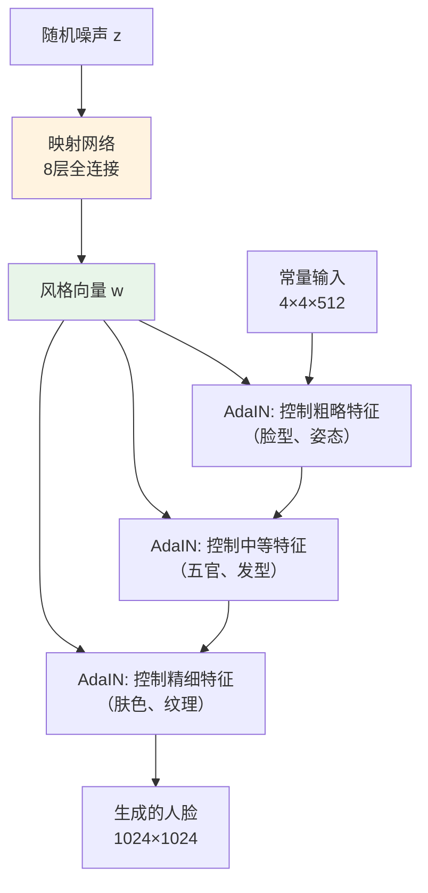
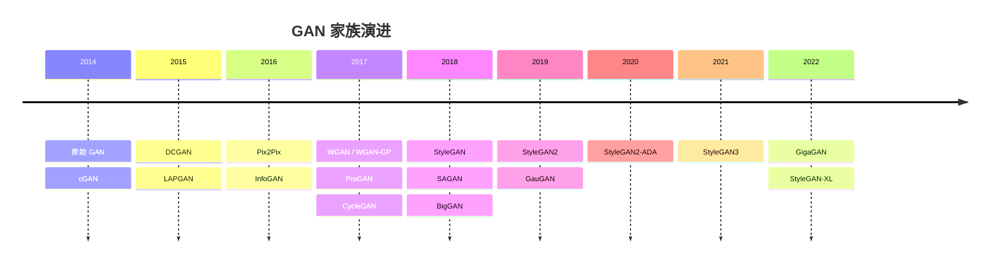

# GAN 深度解析：生成对抗网络及主流代表技术

> 两个 AI 的终极对决——造假大师 vs 鉴定专家。从原始 GAN 到 StyleGAN3，用最生动的方式带你理解 GAN 家族的技术原理与应用场景。

## 引言

想象一个永不停歇的"猫鼠游戏"：

一个天才画家（**生成器**）专门伪造名画，一个火眼金睛的鉴定师（**判别器**）专门鉴别真伪。画家每次造假失败，就会研究鉴定师是怎么看破的，下次画得更逼真；鉴定师每次被骗，也会总结经验，下次检查得更仔细。两人在这场无尽的较量中，能力都在飞速提升——直到画家造出的画连鉴定师都无法分辨真假。

这就是 **GAN（Generative Adversarial Network，生成对抗网络）** 的核心思想。2014 年，Ian Goodfellow 在一篇开创性论文中提出了这个精妙的框架，从此改变了 AI 生成内容的历史。

本文将从最直觉的类比出发，逐步深入 GAN 的数学本质，再到各个里程碑式的变体，带你全面理解 GAN 家族的技术世界。

## 一、原始 GAN：一场精妙的博弈

### 1.1 两个对手的诞生

GAN 由两个神经网络组成，它们的目标完全对立：

| 角色     | 网络         | 输入           | 输出      | 目标       |
| -------- | ------------ | -------------- | --------- | ---------- |
| 造假画家 | **生成器 G** | 随机噪声 z     | 假图片    | 骗过鉴定师 |
| 鉴定专家 | **判别器 D** | 真图片或假图片 | 真/假概率 | 识破造假   |

整个训练过程就像一场"军备竞赛"：



### 1.2 用"考试"来理解训练过程

整个 GAN 的训练可以想象成一场不断升级的"考试"：

**第一轮**：生成器刚开始什么都不会，画出来的是随机噪声（就像小孩的涂鸦）。判别器轻松判断——"这显然是假的"。

**第 100 轮**：生成器学会了大致的形状和颜色。判别器需要更仔细地看了——"这个形状不太对"。

**第 10000 轮**：生成器画出的图片已经非常逼真。判别器开始犹豫——"这……好像是真的？"

**最终状态（理想情况）**：生成器造出的图片和真图无法区分。判别器对任何输入都只能猜——输出概率为 0.5（相当于抛硬币）。

这就是博弈论中的**纳什均衡**——双方都无法通过单方面改变策略来获得更好的结果。

### 1.3 极小极大博弈：GAN 的数学灵魂

GAN 的训练目标用一个优雅的数学公式概括：

> **min_G max_D V(D, G) = E[log D(x)] + E[log(1 - D(G(z)))]**

看起来吓人？我们拆开来看：

- `D(x)` — 判别器看到真图后给出的"真"的概率。**判别器希望这个值趋近 1**（正确判断为真）
- `D(G(z))` — 判别器看到假图后给出的"真"的概率。**判别器希望这个值趋近 0**（正确判断为假），**生成器希望这个值趋近 1**（成功骗过判别器）

用大白话说：

- **判别器（max）**：我要把真的判为真，假的判为假，让 V(D,G) 尽可能大
- **生成器（min）**：我要让假的也被判为真，让 V(D,G) 尽可能小

两个目标完全相反，就像拔河比赛——一根绳子，两个方向拉。

### 1.4 训练的"交替舞步"

GAN 的训练不是同时优化两个网络，而是**交替进行**：

```
重复以下步骤 N 轮：
  ┌──────────────────────────────────────┐
  │ Step 1: 训练判别器 D（k 步）           │
  │   · 从真实数据采样一批真图              │
  │   · 用生成器产生一批假图                │
  │   · 更新 D 的参数，提高分辨真假的能力    │
  ├──────────────────────────────────────┤
  │ Step 2: 训练生成器 G（1 步）           │
  │   · 产生一批假图                       │
  │   · 让 D 评判，根据评判结果更新 G       │
  │   · 目标：让 D 把假图也判为"真"         │
  └──────────────────────────────────────┘
```

> **实战技巧**：在训练早期，生成器太弱，`log(1 - D(G(z)))` 的梯度几乎为零（判别器太容易识破了，没什么可学的）。实践中，生成器改为**最大化 `log(D(G(z)))`** 而非最小化 `log(1 - D(G(z)))`，这提供了更强的学习信号。

### 1.5 GAN 训练的三大"噩梦"

原始 GAN 虽然理论优雅，但训练起来像在走钢丝：

| 问题           | 比喻                                     | 技术描述                               |
| -------------- | ---------------------------------------- | -------------------------------------- |
| **模式崩溃**   | 画家发现画猫最容易骗过鉴定师，于是只画猫 | 生成器只输出少数几种样本，丧失多样性   |
| **训练不稳定** | 画家和鉴定师能力严重不匹配，无法正常切磋 | 损失函数剧烈震荡，不收敛               |
| **梯度消失**   | 鉴定师太强了，画家根本不知道该从哪改进   | 判别器过于完美时，生成器收不到有效梯度 |

这些问题催生了大量 GAN 变体——每一个都在试图解决这些噩梦。

## 二、DCGAN：卷积时代的开山之作

### 2.1 从全连接到卷积

原始 GAN 使用全连接网络，生成的图片分辨率低、质量差（只能处理 MNIST 手写数字之类的简单数据）。2015 年，Radford 等人提出 **DCGAN（Deep Convolutional GAN）**，将卷积神经网络引入 GAN，这是 GAN 历史上第一次质的飞跃。

DCGAN 的核心创新在于给 GAN 制定了一套**架构设计指南**：

| 设计原则                 | 具体做法                                           | 效果                        |
| ------------------------ | -------------------------------------------------- | --------------------------- |
| 用卷积替代池化           | 判别器用步进卷积，生成器用转置卷积                 | 让网络自己学习下采样/上采样 |
| 移除全连接层             | 除了输入输出，网络全部用卷积层                     | 减少参数，提升稳定性        |
| 使用 Batch Normalization | 在每一层后加 BN（输出层除外）                      | 稳定训练，防止模式崩溃      |
| 选择合适的激活函数       | 生成器用 ReLU（输出层用 Tanh），判别器用 LeakyReLU | 帮助梯度流动                |

### 2.2 生成器：从噪声到图像

DCGAN 的生成器就像一个"画面逐步放大"的过程：



从一个 100 维的随机噪声开始，通过一层层转置卷积（可以理解为"反向卷积"），图像分辨率逐步增大，最终生成 64×64 的彩色图片。

### 2.3 DCGAN 的历史意义

DCGAN 最令人兴奋的发现是：**生成器学到了有意义的语义表示**。

它发现了一个著名的"向量算术"：

> **戴墨镜的男人 - 男人 + 女人 = 戴墨镜的女人**

这意味着 GAN 的潜在空间不是一堆混乱的数字，而是编码了有意义的语义概念——这为后来的条件生成和风格控制奠定了基础。

**应用场景**：基础图像生成、图像语义理解、特征学习。

## 三、WGAN：用"推土机"解决训练难题

### 3.1 原始 GAN 的致命缺陷

原始 GAN 使用的 JS 散度有一个致命问题：当生成分布和真实分布没有重叠时（训练早期几乎总是如此），JS 散度是一个常数——**梯度为零**，生成器无法学习。

这就像你让一个新手画家和毕加索比，评委说"都不一样"——但不告诉画家哪里不一样、该怎么改。

### 3.2 Wasserstein 距离：更温和的裁判

2017 年，Arjovsky 等人提出 **WGAN（Wasserstein GAN）**，用 **Wasserstein 距离**（也叫推土机距离/Earth Mover's Distance）替换 JS 散度。

想象你有两堆沙子（代表两个分布），推土机距离衡量的是"把一堆沙子搬运成另一堆形状所需的最小工作量"。

| 度量方式             | 比喻                         | 问题                                             |
| -------------------- | ---------------------------- | ------------------------------------------------ |
| **JS 散度**          | 只说"像"或"不像"（二元判断） | 两堆沙子不挨着时，直接说"完全不像"，无法指导改进 |
| **Wasserstein 距离** | 告诉你"还差多远、该往哪搬"   | 即使两堆沙子不挨着，也能给出连续的、有意义的距离 |

### 3.3 WGAN 的关键改动

```
原始 GAN                        WGAN
────────────                    ────────────
判别器输出概率 (0~1)             → 评论家输出评分（任意实数）
最小化 JS 散度                   → 最小化 Wasserstein 距离
训练不稳定                       → 梯度平滑，训练稳定
需要平衡 G 和 D 的能力           → 评论家越强越好
```

WGAN 还有一个重要的后续改进 **WGAN-GP**（Gradient Penalty），用梯度惩罚替代原始 WGAN 的权重裁剪，进一步提升了训练稳定性。

**应用场景**：作为训练稳定性的通用改进，被广泛应用于各种 GAN 架构中。

## 四、条件 GAN（cGAN）与 Pix2Pix：给 GAN 一个指令

### 4.1 从"随机创作"到"按需生成"

原始 GAN 有一个大问题：**不可控**。你给它一个随机噪声，它生成什么全凭"心情"。你想要一只猫，它可能给你一只狗。

**条件 GAN（Conditional GAN, cGAN）** 的核心思想很简单：**给生成器和判别器都加上一个条件输入**。



这就像给画家一份创作指令："画一只橘猫坐在窗台上"。判别器不仅要判断画得真不真，还要判断**是否符合指令**。

### 4.2 Pix2Pix：图像翻译的瑞士军刀

2016 年，Isola 等人基于 cGAN 提出了 **Pix2Pix**，将"条件"从标签扩展为**一整张图片**——实现了成对的图像到图像翻译。

Pix2Pix 能做的事情令人惊叹：

| 输入       | 输出     | 应用       |
| ---------- | -------- | ---------- |
| 线稿       | 彩色图片 | 自动上色   |
| 语义分割图 | 真实照片 | 场景生成   |
| 白天照片   | 夜晚照片 | 日夜转换   |
| 建筑立面   | 建筑照片 | 建筑可视化 |
| 卫星图     | 地图     | 地图生成   |

Pix2Pix 的技术架构有两个亮点：

- **U-Net 生成器**：编码器-解码器结构加上跳跃连接（skip connections），保留输入图像的细节信息
- **PatchGAN 判别器**：不对整张图片判真假，而是对图片的每个小块（patch）分别判断，这让判别器更关注局部纹理的真实性

### 4.3 Pix2Pix 的局限

Pix2Pix 有一个关键限制：**需要成对的训练数据**。你必须有"线稿-彩图"、"白天-夜晚"这样严格对应的图片对。在很多场景下，收集这样的配对数据非常困难甚至不可能——这催生了下一个革命性变体。

**应用场景**：图像上色、语义图到真实照片转换、图像修复、医学图像分割（Dice ≈ 0.90）。

## 五、CycleGAN：无需配对的跨域翻译

### 5.1 一个大胆的设想

如果我想把照片变成莫奈的画风，难道我需要收集莫奈画过的每个场景的照片吗？当然不！

**CycleGAN（2017）** 解决了一个看似不可能的问题：**在没有配对数据的情况下，学习两个图像域之间的转换**。

### 5.2 双向翻译 + 循环一致性

CycleGAN 的核心灵感来自"翻译的回译"——如果你把一句中文翻译成英文，再翻译回中文，应该得到原来那句话。

它包含两个生成器和两个判别器：



**循环一致性损失**就是约束：`F(G(x)) ≈ x`，即 马 → 斑马 → 马，还原后应该和原图一样。反方向同理：斑马 → 马 → 斑马。

这个约束非常巧妙——它确保转换只改变"风格"（条纹 vs 纯色），而不改变"内容"（马的姿态、背景）。

### 5.3 经典应用

CycleGAN 的一些标志性应用：

- **马 ↔ 斑马**：在马和斑马之间自由切换（最经典的 demo）
- **照片 ↔ 油画**：将照片变成莫奈/梵高风格，或反过来
- **夏天 ↔ 冬天**：同一场景在不同季节之间转换
- **苹果 ↔ 橘子**：水果的外观变换
- **医学影像**：CT 和 MRI 之间的跨模态转换

### 5.4 局限与发展

CycleGAN 对于形状变化较大的转换效果有限（比如猫 → 狗），因为循环一致性约束太强，限制了几何结构的改变。后续的 **CUT（Contrastive Unpaired Translation）** 等方法放松了这个约束。

**应用场景**：风格迁移、域适应、季节/天气变换、跨模态医学影像转换。

## 六、ProGAN → StyleGAN 系列：走向照片级真实

### 6.1 ProGAN：渐进式生长

生成高分辨率图像一直是 GAN 的难题。2017 年，NVIDIA 的 Karras 等人提出 **ProGAN（Progressive GAN）**，用了一个天才般的训练策略——**让网络"长大"**：

```
训练阶段:
  4×4 → 8×8 → 16×16 → 32×32 → 64×64 → 128×128 → 256×256 → 512×512 → 1024×1024
  ────────────────────────────────────────────────────────────────────────────────→
  先学会画轮廓             再学画细节              最终画出高清大图
```

就像教小孩画画——先用粗笔画大致轮廓，再换细笔添加细节。每次增加分辨率时，新增的层会**平滑地淡入**（通过 α 参数逐步增加新层的权重），避免训练崩溃。

### 6.2 StyleGAN：风格化的艺术大师

2018 年，同样来自 NVIDIA 的 **StyleGAN** 在 ProGAN 的基础上引入了**风格调制**机制，实现了对生成图像前所未有的精细控制。

StyleGAN 的核心创新——**风格注入**：



**映射网络**的作用就像一个"风格翻译器"：把随机噪声 z 变成更有意义的风格向量 w，再通过 AdaIN（自适应实例归一化）注入到合成网络的每一层。

不同层控制不同层级的特征：

| 注入层级                        | 控制的特征 | 例子                 |
| ------------------------------- | ---------- | -------------------- |
| 低分辨率层（4×4 ~ 8×8）         | 粗略结构   | 脸型、姿态、发型类型 |
| 中分辨率层（16×16 ~ 32×32）     | 中等特征   | 五官细节、发色、妆容 |
| 高分辨率层（64×64 ~ 1024×1024） | 精细纹理   | 肤色、毛孔、发丝     |

这意味着你可以**混合搭配**：用 A 的脸型 + B 的五官 + C 的肤色，生成一张全新的面孔！

### 6.3 StyleGAN2 & StyleGAN3：持续进化

**StyleGAN2（2020）** 修复了 StyleGAN 的"水滴伪影"问题，用权重解调（Weight Demodulation）替换 AdaIN，生成质量进一步提升，在人脸生成上达到了以假乱真的水平（FID 低至 2.84）。

**StyleGAN3（2021）** 解决了"纹理粘连"问题——在 StyleGAN2 中，当你连续改变潜在向量时，纹理细节会"粘"在固定的像素位置上不自然地移动。StyleGAN3 通过引入旋转等变性和抗锯齿处理，让生成的图像在连续变化时更加自然流畅。

**应用场景**：高分辨率人脸生成、人脸属性编辑、艺术创作、数据增强、deepfake 检测研究。

## 七、其他重要变体速览

### 7.1 SAGAN：让 GAN 看到全局

**SAGAN（Self-Attention GAN, 2018）** 将自注意力机制引入 GAN。传统卷积只能看到局部区域，而自注意力让网络能够关注图像中远距离位置之间的关系——比如在生成狗的图片时，确保四条腿的纹理一致。

### 7.2 BigGAN：大力出奇迹

**BigGAN（2018）** 验证了一个朴素但重要的结论：**更大的 batch size + 更深的模型 = 更好的生成质量**。它在 ImageNet 上生成了当时最高质量的条件图像（FID 7.4，IS 166.5），但代价是需要 128～512 块 TPU 来训练。

### 7.3 GauGAN：语义画布

**GauGAN（NVIDIA, 2019）** 让用户通过简单的语义涂鸦——用不同颜色标注"天空"、"草地"、"水面"——就能生成逼真的风景照片。它使用 SPADE（空间自适应归一化）技术，让语义标签在每一层都能影响生成结果。

## 八、GAN 的应用全景

### 8.1 图像生成与编辑

| 应用         | 代表技术           | 说明                     |
| ------------ | ------------------ | ------------------------ |
| 人脸生成     | StyleGAN2/3        | 生成以假乱真的高清人脸   |
| 图像超分辨率 | SRGAN, ESRGAN      | 将低分辨率图片增强为高清 |
| 图像修复     | DeepFill, LaMa     | 智能填充图像中的缺失区域 |
| 图像上色     | Pix2Pix, ChromaGAN | 给黑白照片自动上色       |

### 8.2 创意与艺术

| 应用        | 代表技术               | 说明                       |
| ----------- | ---------------------- | -------------------------- |
| 风格迁移    | CycleGAN, Neural Style | 将照片转换为不同的艺术风格 |
| AI 艺术创作 | StyleGAN + CLIP        | 结合语言引导生成艺术作品   |
| 时尚设计    | FashionGAN             | 虚拟试衣、服装设计生成     |

### 8.3 科学与工业

| 应用     | 代表技术          | 说明                        |
| -------- | ----------------- | --------------------------- |
| 医学影像 | CycleGAN, Pix2Pix | CT/MRI 跨模态转换、数据增强 |
| 药物发现 | MolGAN            | 生成候选药物分子结构        |
| 异常检测 | AnoGAN, GANomaly  | 检测工业产品中的缺陷        |
| 数据增强 | 各类 GAN          | 为小样本数据集生成训练数据  |

### 8.4 视频与 3D

| 应用     | 代表技术         | 说明                   |
| -------- | ---------------- | ---------------------- |
| 视频生成 | MoCoGAN, DVD-GAN | 生成短视频片段         |
| 视频预测 | FutureGAN        | 预测未来帧             |
| 3D 生成  | GET3D, EG3D      | 从 2D 图像生成 3D 模型 |

## 九、GAN vs 扩散模型：时代交替

近年来，扩散模型（Diffusion Models）在图像生成质量和多样性上全面超越了 GAN，成为 AI 图像生成的新主流。但 GAN 并未退出历史舞台：

| 维度       | GAN                        | 扩散模型                     |
| ---------- | -------------------------- | ---------------------------- |
| 生成速度   | **极快**（一次前向传播）   | 较慢（需要数十到数百步迭代） |
| 图像质量   | 高（可能有伪影）           | **极高**（更少伪影）         |
| 多样性     | 可能模式崩溃               | **高多样性**                 |
| 训练稳定性 | 不稳定，需要技巧           | **相对稳定**                 |
| 可控性     | 通过条件输入或潜在空间操作 | **通过文本、图像等灵活控制** |
| 应用趋势   | 实时应用、超分辨率、视频   | 文生图、图像编辑             |

实际上，许多现代系统是**两者的结合**：

- **VQGAN + CLIP** = 用 GAN 的解码器 + CLIP 的语义引导
- **Latent Diffusion** 的 VAE/VQGAN 编码器就是 GAN 训练的
- **GigaGAN（2023）** 证明了经过精心设计，GAN 仍然可以达到扩散模型级别的质量

## 十、GAN 发展时间线



## 总结

GAN 的故事是一个关于"对抗中成长"的故事。从 2014 年 Goodfellow 提出那个精妙的对抗框架开始，GAN 家族在短短几年内经历了爆炸式的发展：

- **DCGAN** 让 GAN 学会了用卷积生成高质量图像
- **WGAN** 用推土机距离解决了训练不稳定的难题
- **cGAN / Pix2Pix** 让 GAN 从随机创作变为按需生成
- **CycleGAN** 打破了对配对数据的依赖
- **StyleGAN** 系列将人脸生成推向了照片级真实

虽然扩散模型已经成为新的主流范式，但 GAN 的思想——对抗训练——仍在深刻影响着整个 AI 生成领域。理解 GAN，就是理解 AI 如何学会"创造"的一段重要历史。

## 参考资料

- [Goodfellow et al., "Generative Adversarial Nets" (2014)](https://arxiv.org/abs/1406.2661) — 开山之作
- [Radford et al., "Unsupervised Representation Learning with DCGANs" (2015)](https://arxiv.org/abs/1511.06434) — DCGAN
- [Arjovsky et al., "Wasserstein GAN" (2017)](https://arxiv.org/abs/1701.07875) — WGAN
- [Isola et al., "Image-to-Image Translation with Conditional Adversarial Networks" (2016)](https://arxiv.org/abs/1611.07004) — Pix2Pix
- [Zhu et al., "Unpaired Image-to-Image Translation using Cycle-Consistent Adversarial Networks" (2017)](https://arxiv.org/abs/1703.10593) — CycleGAN
- [Karras et al., "A Style-Based Generator Architecture for GANs" (2018)](https://arxiv.org/abs/1812.04948) — StyleGAN
- [Karras et al., "Analyzing and Improving the Image Quality of StyleGAN" (2020)](https://arxiv.org/abs/1912.04958) — StyleGAN2
- [IBM — What are Generative Adversarial Networks?](https://www.ibm.com/think/topics/generative-adversarial-networks)
- [GAN Variants: CGAN, Pix2Pix, CycleGAN — Medium](https://medium.com/@hugmanskj/variants-of-gan-cgan-pix2pix-cyclegan-f7869de53152)
- [GAN Variants: DCGAN, Pix2pix, CycleGAN — kharshit.github.io](https://kharshit.github.io/blog/2019/04/05/generative-adversarial-networks-variants-dcgan-pix2pix-cyclegan)
