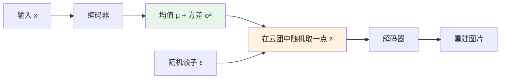
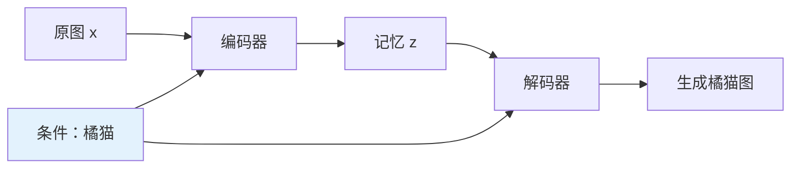
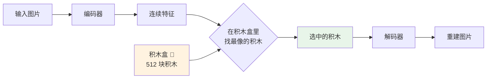
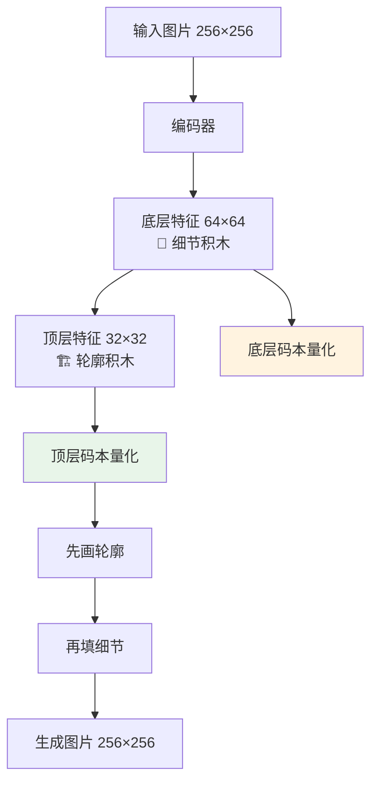
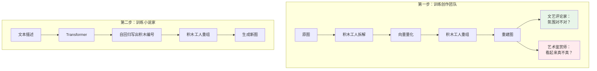
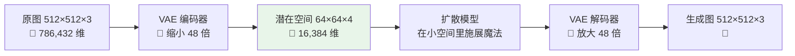
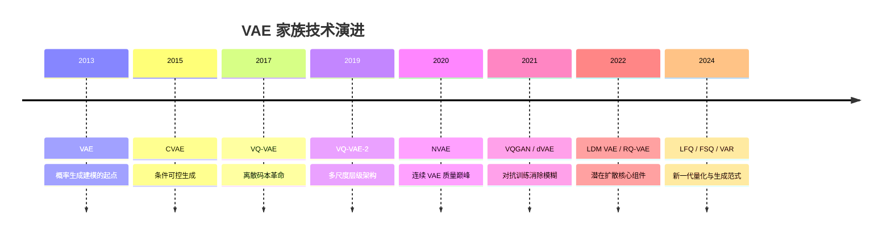

# VAE 深度解析：变分自编码器及主流代表技术

> 从经典 VAE 到 VQ-VAE、NVAE、VQGAN，再到 Stable Diffusion 的潜在空间引擎——用直觉和类比，带你真正理解 VAE 家族的技术原理与应用场景。

## 引言

假设你是一个侦探，需要根据目击者的描述画出嫌疑人的肖像。目击者不可能记住脸上每一个像素，而是记住了一些**关键特征**——"圆脸、浓眉、高鼻梁、短发"。画师根据这些特征就能还原出一张八九不离十的肖像画。

**VAE（Variational Autoencoder，变分自编码器）** 做的就是这件事：学会把一张图片"记忆"为一组关键特征（潜在向量），然后从这些特征"还原"出图片。

你可能觉得 VAE 已经"过时"了——毕竟扩散模型才是当下主流。但事实恰恰相反：Stable Diffusion、DALL-E、FLUX 这些明星模型的心脏里，都跳动着一颗 VAE。它作为图像的"压缩引擎"，是整个潜在扩散模型（Latent Diffusion Model）得以高效运行的关键。

本文将用生动的类比 + 深入的原理，带你走进 VAE 家族的技术世界。

## 一、经典 VAE：学会"模糊记忆"的画家

### 1.1 先理解普通自编码器：精确但死板的复印机

想象一台"超级复印机"：把一张 A4 纸放进去（编码），机器把它压缩成一个小纸条上的编码（潜在向量），然后再根据这个编码还原出 A4 纸（解码）。

这就是**普通自编码器（Autoencoder）**。它的问题在于：每张图都被编码为一个**精确的、固定的点**。这些点之间可能隔着巨大的空白地带——就像一个城市里只有零散的几栋房子，其他地方全是荒地。你在荒地上随机选一个位置，根本建不出有意义的东西。

**结论**：普通自编码器适合"压缩-还原"，但不适合"创造新东西"。

### 1.2 VAE 的灵感：从"精确记忆"到"模糊印象"

VAE 的核心突破非常精妙：**把精确的点替换为模糊的云团**。

还是那个侦探的例子。普通自编码器像是目击者说"鼻子正好 3.7 厘米长"——太精确了，换一个目击者就完全对不上。VAE 的做法是让目击者说"鼻子大概在 3 到 4 厘米之间"——给出一个**范围**而不是一个点。

技术上说，编码器不再输出一个固定向量，而是输出一个概率分布的参数——**均值 μ**（中心在哪）和**方差 σ²**（范围多大）。然后从这个分布中随机采样一个点 z，交给解码器去还原图片。



这样做的好处是：每张图片不再是一个孤零零的点，而是一片"领地"。不同图片的领地会互相重叠，填满整个空间——就像城市规划得合理了，到处都有房子，随便选一个位置都能找到有意义的东西。

### 1.3 两个相互拉扯的力量：ELBO 损失函数

VAE 的训练目标可以用一个生活中的类比来理解——**你在教一个画师记忆和重绘名画**：

```
总目标 = 画得像（重建损失） + 记忆要规范（KL 散度）
```

- **画得像（重建损失）**：画师还原出的画应该尽可能像原画。这驱动模型学好编码和解码。
- **记忆要规范（KL 散度）**：画师的"记忆方式"不能太个性化，必须遵循统一的"记忆格式"（标准正态分布 N(0,I)）。这保证了不同画的记忆之间可以平滑过渡。

这两个目标是**相互拉扯**的：

- 如果只追求"画得像"，模型会退化为普通自编码器——记忆极其精确但无法创造新图
- 如果只追求"记忆规范"，所有图的记忆都坍缩到同一个点——什么都记不住

VAE 的训练就是在两者之间找到平衡。

> 数学上，这个平衡点就是 **ELBO（Evidence Lower Bound）**：
>
> `log p(x) ≥ E_q(z|x)[log p(x|z)] - D_KL(q(z|x) || p(z))`
>
> 前一项是重建损失，后一项是 KL 散度正则化。

### 1.4 重参数化技巧：让"掷骰子"也能学习

训练神经网络需要梯度反向传播，但"从分布中随机采样"这个操作就像掷骰子——随机过程是没有梯度的，没法告诉网络"往哪个方向调整更好"。

VAE 用了一个巧妙的**障眼法**：

> 与其让网络自己掷骰子，不如先在外面掷好骰子 ε，再让网络用 ε 算出结果：
>
> **z = μ + σ × ε**，其中 ε 是从标准正态分布随机采的

这样，z 虽然是随机的，但它是 μ 和 σ 的**确定性函数**——梯度可以正常传播了！随机性被"外包"给了 ε。

打个比方：就像把"随机选一家餐厅"变成"先随机选一个方向（ε），然后从家（μ）出发，走一段距离（σ），看到什么餐厅就吃什么"。方向是随机的，但"从家出发"和"走多远"是可以学习和调整的。

### 1.5 KL 散度：为什么需要"统一的记忆格式"

想象一个图书馆，每本书都有自己的编号。如果每个图书管理员都按自己的规则编号——有人按作者姓名，有人按出版日期，有人按颜色——那这个图书馆就是一团糟。

KL 散度就是在说：**所有书都必须按同一套标准编号**（标准正态分布）。这带来三个好处：

- **连续性**：编号相近的书，内容也相似——潜在空间中相邻的点解码出相似的图
- **完整性**：每个编号都对应一本书，没有"空号"——空间中任何点都能解码出有意义的图
- **可插值**：编号 1 的书是猫，编号 2 的书是狗，编号 1.5 可能是一只"猫狗混合体"——线性插值生成平滑过渡

### 1.6 VAE 的"老毛病"：为什么总是模糊

经典 VAE 有个著名的缺点——生成的图总是带着一层"磨皮美颜"效果，缺少细节。

原因很直觉：重建损失通常用 MSE（均方误差），它在说"你画的每个像素和原图的差距之和要最小"。当一根头发丝可能出现在左边也可能出现在右边时，MSE 的最优解是什么？**两边各画半根**——也就是模糊！

这就像你问 100 个人"你最喜欢的颜色是什么"，然后把所有回答混在一起——你得到的不是某个鲜明的颜色，而是灰蒙蒙的混合色。

这个根本问题，驱动了后续一系列 VAE 变体的诞生。

## 二、条件 VAE（CVAE）：给画家一张说明书

### 2.1 从"随机创作"到"按需创作"

经典 VAE 像一个自由画家——你不知道他会画什么。**CVAE（Conditional VAE）** 则给画家递了一张"需求说明书"：请画一只橘猫、请画一个微笑的老人。

技术上，CVAE 在编码器和解码器中同时引入**条件信息 c**：



编码器学的是"在知道这是橘猫的前提下，这张图有什么特别之处"（比如胖瘦、姿态、背景）。解码器学的是"给定橘猫 + 这些特别之处，画出来"。

### 2.2 实际应用

| 场景         | 条件 c         | 效果               |
| ------------ | -------------- | ------------------ |
| 按类别生成   | "猫"或"狗"     | 想要什么画什么     |
| 人脸属性编辑 | "微笑"/"衰老"  | 改表情、改年龄     |
| 文本引导生成 | "海边的夕阳"   | 早期文生图方案之一 |
| 缺失填充     | 图片的上半部分 | 自动补全下半部分   |

## 三、VQ-VAE：把"模糊日记"换成"乐高积木"

### 3.1 一个关键洞察

经典 VAE 的潜在空间是**连续的**——像水彩画，颜色之间可以无限渐变。这很优雅，但有两个麻烦：

1. **后验坍塌**：如果解码器太强，它会学会"不看 z 也能猜个大概"，z 就被浪费了。就像一个太聪明的画师，你给他任何关键词他都画同样的画——关键词没有被利用。
2. **生成模糊**：连续空间 + MSE = 平均 = 模糊（上面分析过）。

### 3.2 VQ-VAE 的妙招：离散码本

**VQ-VAE（Vector Quantized VAE）** 的思路是：**把水彩画换成乐高积木**。

想象你有一盒 512 块不同形状颜色的乐高积木（码本）。编码器看了一张图后，不再写一段"模糊日记"，而是说"这张图可以用 第47号积木 + 第128号积木 + 第305号积木 拼出来"。解码器拿到这些积木编号，把它们拼成图片。



技术细节：编码器输出连续向量 z_e，在码本 {e_1, ..., e_K} 中找到欧氏距离最近的 e_k，用 e_k 替代 z_e 送入解码器。

### 3.3 一个棘手的问题：离散操作怎么求梯度

"在码本中找最近邻"是一个离散操作——就像"选 A 还是选 B"，没有中间状态，自然没有梯度。

VQ-VAE 用了一个叫 **straight-through estimator** 的技巧：

> 前向传播时用量化后的积木 e_k，反向传播时假装量化没有发生过，梯度直接穿过量化操作传给编码器。

这就像考试时你选了 B，但老师批改时当你填的是最接近正确答案的选项来打分——虽然不完全准确，但足够让你知道该往哪个方向改进。

训练用三个损失一起优化：

| 损失     | 类比                       | 作用         |
| -------- | -------------------------- | ------------ |
| 重建损失 | 拼出来的图要像原图         | 驱动编解码器 |
| 码本损失 | 积木要往编码器指的方向移动 | 更新码本     |
| 承诺损失 | 编码器不能跳来跳去，要稳定 | 稳定训练     |

### 3.4 为什么离散化是一场革命

VQ-VAE 开启了一个全新范式——把图片变成"一串编号"（离散 token）。这意味着：

- 图片变成了类似文字的东西——`[47, 128, 305, 89, ...]`
- 自然语言处理领域的强大工具（GPT、Transformer）可以直接用来"写"图片
- 后来的 DALL-E、LlamaGen 都是沿着这条路走下去的

## 四、VQ-VAE-2：从"一层乐高"到"双层建筑"

### 4.1 分层的智慧

一层乐高积木既要表达全局构图（"这是一栋房子"），又要表达细节纹理（"窗户上有花纹"），压力很大。

**VQ-VAE-2**（2019）引入了**双层结构**：

- **顶层**：大块积木拼大致轮廓——低分辨率（32×32），捕捉"这是一栋房子、天是蓝的"
- **底层**：小块积木补充细节——高分辨率（64×64），捕捉"窗户花纹、墙壁纹理"



### 4.2 两步生成：先打草稿再精修

生成新图时分两步：

1. 用 PixelCNN 先生成顶层 token（画草稿）
2. 再根据草稿生成底层 token（精修细节）

效果如何？VQ-VAE-2 在 256×256 分辨率上的生成质量首次追平了同期的 GAN 模型（BigGAN）——这是 VAE 方法的一个里程碑。

## 五、NVAE：把"模糊"压缩到极致

### 5.1 不走离散路线的另一个选择

VQ-VAE 用离散化解决了模糊问题。但有人问：**连续 VAE 如果够深够复杂，能不能也拍出清晰的照片？**

**NVAE（Nouveau VAE）**（2020）给出了肯定的答案。它的策略是"暴力堆叠"：

- **20+ 层潜在变量**：就像画师先画一个模糊的底稿，然后一层层叠加细节。第一层画大致色块，第二层画形状轮廓，第三层画纹理......第 20 层画睫毛和毛孔。
- **残差修正**：每一层不是从零开始画，而是在上一层的基础上"改一改"——只学习增量，效率更高。

### 5.2 成果

NVAE 在 CelebA-HQ 256×256 上取得了当时连续 VAE 的最好成绩，证明了：只要架构够深、设计够巧，不用离散化、不用 GAN，纯 VAE 也能出好图。

## 六、VQGAN：给乐高积木请了一位鉴赏师

### 6.1 VQ-VAE 还有什么不够好

VQ-VAE 解决了"模糊"问题，但重建出的图在**纹理真实感**上仍有欠缺——看起来"对"，但不够"真"。就像一幅画的构图正确，但笔触不够自然。

原因在于 VQ-VAE 的损失函数只看"像素级差异"，不理解"视觉感受"。一张图的纹理稍有偏移，像素级误差很大，但人眼觉得完全可以接受。

### 6.2 VQGAN 的三板斧

**VQGAN**（2021）的解决方案像是组建了一个"图片创作团队"：

| 角色       | 对应技术         | 负责什么                                 |
| ---------- | ---------------- | ---------------------------------------- |
| 积木工人   | VQ-VAE 编解码器  | 把图片拆成积木，再拼回来                 |
| 艺术鉴赏师 | GAN 判别器       | 判断拼出来的图"看起来真不真"，给工人反馈 |
| 文艺评论家 | VGG 感知损失     | 不看细节像素，看整体"氛围"对不对         |
| 小说家     | Transformer 先验 | 学会"从无到有"编出一串积木编号           |



**关键改进**：用"艺术鉴赏师"（GAN 判别器）替代"像素级打分"（MSE），生成的纹理终于"以假乱真"了。

### 6.3 VQGAN 的深远影响

VQGAN 搭建了一座桥梁：**图片 → 离散 token → Transformer 生成**。后来的明星模型沿着这条路走出了精彩的风景：

- **DALL-E**（2021）：用 dVAE（离散 VAE 的一种）把图片变成 token，再用 GPT 生成 token
- **Parti**（2022）：Google 200 亿参数的文生图模型，同样是 token 化 + Transformer
- **LlamaGen**（2024）：用 LLaMA 架构直接生成图像 token

## 七、Stable Diffusion 中的 VAE：隐藏的幕后英雄

### 7.1 为什么 Stable Diffusion 离不开 VAE

Stable Diffusion 的核心理念是**在压缩后的小空间里做扩散**，而不是在原始像素上做。

打个比方：你要在一幅 512×512 的画上涂涂改改（扩散去噪）。直接在大画布上操作太慢了（786,432 个数字）。聪明的做法是——先把大画布缩小成 64×64 的缩略图（16,384 个数字），在缩略图上涂改，改完后再放大回去。

**VAE 就是那台缩小机和放大机**：编码器把大图压缩 48 倍到潜在空间，解码器再从潜在空间还原回大图。



### 7.2 VAE 决定了画质天花板

这里有一个关键洞察：**VAE 的重建质量就是整个系统的天花板**。

就像那台缩小机——如果缩小时丢失了眼睫毛的细节，那无论放大机多高级，眼睫毛也找不回来了。扩散模型再强大，也只能在 VAE 给定的"格式"里发挥。

这就是为什么 Stable Diffusion 的每次大升级都伴随着 VAE 的升级：

| 版本        | VAE 改进                        | 效果                     |
| ----------- | ------------------------------- | ------------------------ |
| SD 1.x      | 基础 VAE，4 通道潜在空间        | 能用，但细节有限         |
| SDXL        | 升级 VAE，更好的细节保留        | 手指、文字等细节明显改善 |
| SD 3 / FLUX | 16 通道潜在空间，更强的重建能力 | 接近无损的编解码         |

### 7.3 技术细节

Stable Diffusion 的 VAE 不是经典的高斯 VAE，而是带有改良的版本：

- **感知损失**：不只看像素差异，还比较 VGG 网络提取的"视觉特征"差异——让重建图在人眼看来更真实
- **对抗损失**：加入了小型 GAN 判别器——防止生成模糊的纹理
- **轻量 KL 正则化**：KL 散度的权重被设得很小，因为这里的 VAE 不需要生成功能，只需要好的编解码

## 八、前沿进展：积木技术的进化

### 8.1 残差量化（RQ-VAE）：一次量化不够，那就多来几次

回想 VQ-VAE：编码器输出一个向量，在码本中找最近的积木。但"最近的积木"毕竟不是完美匹配——总有误差。

**RQ-VAE** 的思路非常直觉：**把误差也量化掉！**

- 第一次：找到最近的积木 e₁，计算残差 r₁ = z - e₁
- 第二次：给残差 r₁ 也找最近的积木 e₂，计算新残差 r₂ = r₁ - e₂
- 第三次、第四次......

就像雕塑家先用大刀粗雕（第一级），再用小刀精修（第二级），最后用砂纸打磨（第三级）。每一级都在弥补上一级的不足。

### 8.2 Lookup-Free Quantization（LFQ）：扔掉积木盒

传统 VQ 有一个尴尬问题：码本里 512 块积木，可能只有 100 块经常被用到，剩下的 400 多块积木在角落里吃灰——**码本利用率低**。

**LFQ** 的解决方案很激进：**干脆不要码本了！** 直接规定每个维度只能取 {-1, +1} 两个值。所有可能的组合自动构成一个"隐式码本"。

如果潜在空间有 18 个维度，那隐式码本的大小就是 2¹⁸ = 262,144——比任何手工维护的码本都大，而且每个"积木"都有可能被用到。Open-MAGVIT2 就采用了这种方案。

### 8.3 有限标量量化（FSQ）：每个维度独立"四舍五入"

**FSQ** 比 LFQ 更简单：每个维度独立量化为有限个整数值，比如 {-2, -1, 0, 1, 2}。

就像温度计的刻度——你不需要一个"温度码本"来查找，只要读出最近的刻度就行。不需要码本损失，不需要 EMA 更新，实现极其简单。Google 的实验表明 FSQ 在多个任务上可匹配传统 VQ 的性能。

### 8.4 VAR：先画大轮廓，再填小细节

**VAR（Visual Autoregressive Modeling）**（2024）挑战了"从左到右逐个 token 生成"的传统范式。它的生成方式更像人类画家：

1. 先生成一个 1×1 的超低分辨率 token map（"画面的整体色调"）
2. 再扩展到 2×2（"大致构图"）
3. 再到 4×4、8×8......逐步精化
4. 最终到目标分辨率

这比逐 token 的序列生成快得多（每一步生成整个分辨率层），而且全局一致性更好——因为轮廓早已确定，细节只是在轮廓基础上精修。

## 九、VAE 家族全景图



| 模型     | 潜在空间   | 一句话总结                  | 代表应用                |
| -------- | ---------- | --------------------------- | ----------------------- |
| VAE      | 连续高斯   | 学会"模糊记忆"的画家        | 特征学习、数据增强      |
| CVAE     | 连续高斯   | 拿到说明书的画家            | 可控生成、属性编辑      |
| VQ-VAE   | 离散码本   | 乐高积木取代水彩画          | 语音合成、图像 token 化 |
| VQ-VAE-2 | 多层离散   | 双层建筑：轮廓 + 细节       | 高分辨率图像生成        |
| NVAE     | 深层连续   | 20 层精修的油画大师         | 高质量连续生成          |
| dVAE     | 离散       | DALL-E 的眼睛               | 图像 token 化           |
| VQGAN    | 离散 + GAN | 积木工人 + 鉴赏师           | 文生图、图像编辑        |
| RQ-VAE   | 多级残差   | 粗雕 → 精修 → 打磨          | 高保真 token 化         |
| LDM VAE  | 连续 KL    | Stable Diffusion 的压缩引擎 | 潜在扩散模型            |
| FSQ      | 有限标量   | 温度计式四舍五入            | 简化离散表示            |
| LFQ      | 二值       | 扔掉积木盒的量化            | Open-MAGVIT2            |

## 十、应用场景：VAE 无处不在

### 10.1 潜在空间扩散——当前最重要的应用

Stable Diffusion、SDXL、SD3、FLUX、Midjourney......几乎所有主流文生图系统都依赖 VAE 把像素空间压缩到潜在空间。没有 VAE，这些模型要么跑不动，要么慢到不可用。VAE 是现代 AI 绘画的"地基"。

### 10.2 图像 Token 化——连接图像与语言的桥梁

VQ-VAE / VQGAN 将图像变成离散 token 序列，让 Transformer 可以像处理文字一样处理图片。DALL-E、Parti、LlamaGen、Emu3 等模型都站在这座桥上。

### 10.3 图像压缩

相比 JPEG 和 WebP，基于 VAE 的神经编解码器在极低码率下仍能保持可接受的画质——像一位记忆力超群的画家，只需寥寥数语就能还原一幅画的神韵。

### 10.4 异常检测——"重建不出来的就是异常"

VAE 对"见过的东西"重建误差低，对"没见过的东西"重建误差高。利用这个特性：

- **工业质检**：学会正常产品的样子，重建误差大的就是次品
- **医学影像**：学会正常组织的样子，重建异常的区域可能是病变

### 10.5 数据增强

训练数据不够？在 VAE 的潜在空间里做插值，就能"无中生有"地创造新样本。两张猫的潜在向量取平均，你就得到了一只新的、合理的猫。

### 10.6 药物发现

把分子结构编码到 VAE 的潜在空间，在空间中搜索满足目标性质的区域，解码出新分子——这比在离散的分子结构空间中搜索高效得多。VAE 正在加速新药研发的流程。

### 10.7 语音合成

VQ-VAE 在语音领域同样大放异彩。将语音编码为离散 token，可以实现高质量的语音合成和声音转换——本质上和"图像 token 化"是同一个思路。

## 总结

让我们用一段话回顾 VAE 的整个故事：

**2013 年**，VAE 诞生了——一个学会"模糊记忆"的画家。他画得不够清楚，但他第一次让机器理解了"创造"的数学语言。**2017 年**，VQ-VAE 把水彩画换成了乐高积木，图像从此可以像文字一样被处理。**2021 年**，VQGAN 请来了一位艺术鉴赏师，积木拼出来的图终于以假乱真。同年，**Latent Diffusion** 让 VAE 找到了最完美的角色——不再自己画画，而是为扩散模型搭建舞台。

今天，每一张由 Stable Diffusion、FLUX 或 Midjourney 生成的图片，都要经过 VAE 的编码和解码。VAE 不是聚光灯下的明星，但它是整个舞台的地基——没有它，AI 绘画的大厦无从建起。

## 参考文献

- Kingma & Welling. "Auto-Encoding Variational Bayes." ICLR 2014.
- van den Oord et al. "Neural Discrete Representation Learning." NeurIPS 2017.
- Razavi et al. "Generating Diverse High-Fidelity Images with VQ-VAE-2." NeurIPS 2019.
- Vahdat & Koltun. "NVAE: A Deep Hierarchical Variational Autoencoder." NeurIPS 2020.
- Esser et al. "Taming Transformers for High-Resolution Image Synthesis." CVPR 2021.
- Rombach et al. "High-Resolution Image Synthesis with Latent Diffusion Models." CVPR 2022.
- Yu et al. "Language Model Beats Diffusion — Tokenizer is Key to Visual Generation." ICLR 2024.
- Mentzer et al. "Finite Scalar Quantization: VQ-VAE Made Simple." ICLR 2024.
